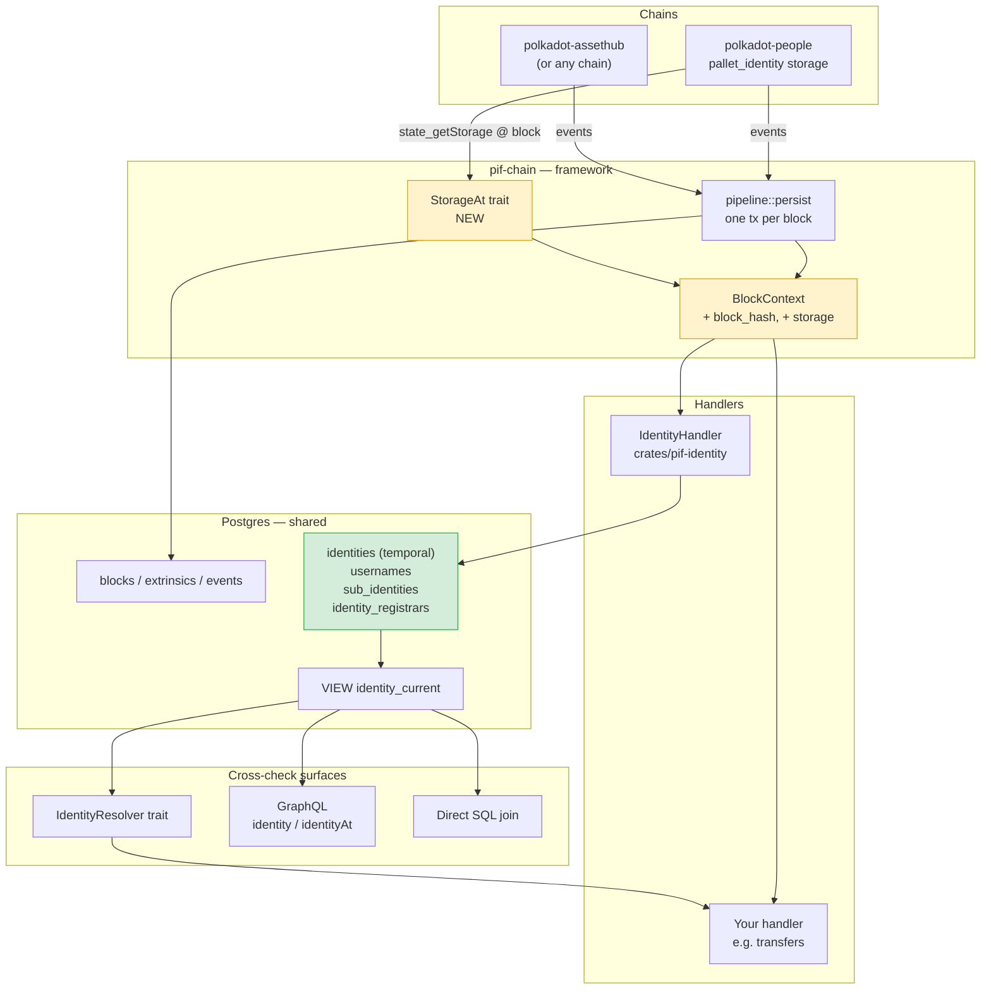
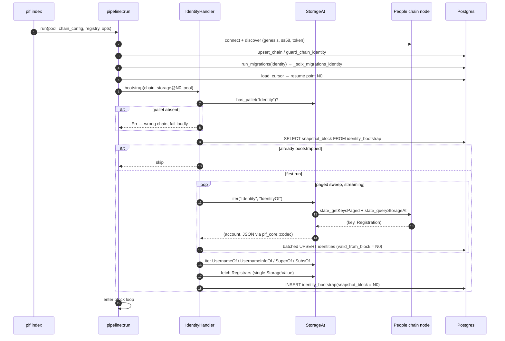
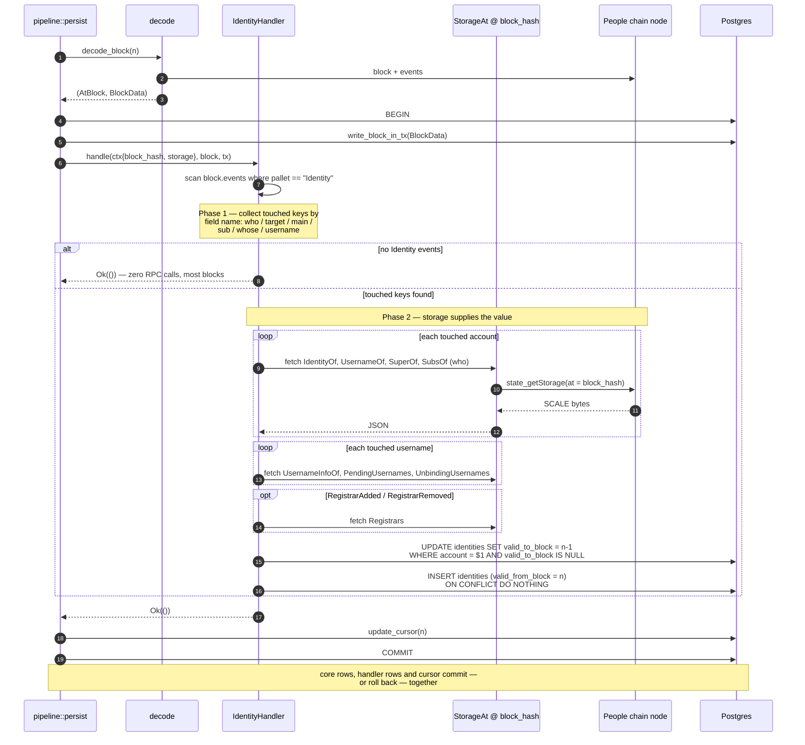
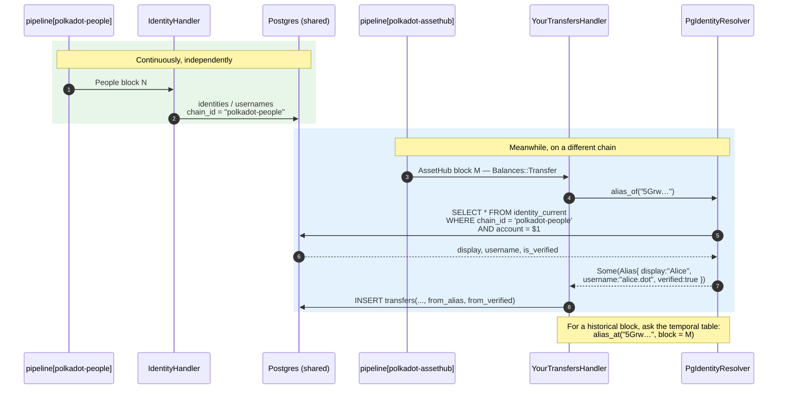
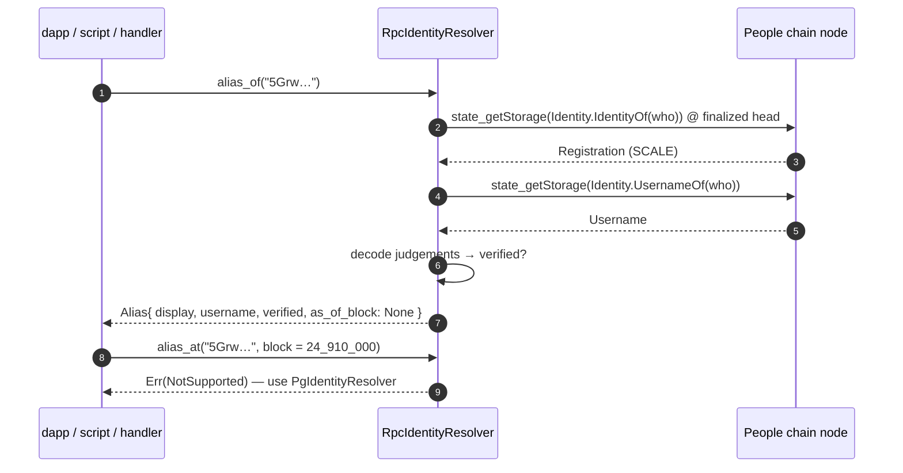

# IPD-001 — People-Chain Identity & Alias Indexing

| | |
|---|---|
| **Status** | Implemented |
| **Author** | Darwin Subramaniam |
| **Created** | 2026-08-15 |
| **Target chain** | `polkadot-people` (Polkadot People system chain) |
| **Handler name** | `identity` |
| **Feature flag** | `handler-identity` |
| **Affects** | `pif-chain` (new capability), `pif-api` (unblocking fix), new crate `pif-identity` |

---

## 1. Summary

PIF today can tell you *that* a wallet moved money, but not *who* the wallet claims to be.
Polkadot moved `pallet-identity` off the relay chain onto the **People** system chain, which is
now the home of display names, registrar judgements, sub-identities, and the newer **usernames**
(`alice.dot`).

This proposal adds a first-party `identity` handler for the People chain, plus the framework
capability it needs, so that **any future indexer — on any chain — can cross-check whether a
wallet has an alias, and whether that alias is verified.**

Three consumption surfaces are delivered, because "does this wallet have an alias" is asked in
three quite different situations:

1. **SQL view** — for anything sharing the Postgres instance (cheapest, no coupling).
2. **Rust `IdentityResolver` trait** — for other handlers to call from inside `handle()`.
3. **GraphQL** — for dapps and external services.

---

## 2. Motivation — and the question this answers

> *"Is there something we can provide using the RPC, or is an indexer required?"*

Both, and the split is not arbitrary. The RPC answers **"now"**; only an index answers
**"then"** or **"all"**.

| Question | Mechanism | Indexer needed? |
|---|---|---|
| Does `5Grw…` have an alias **right now**? | `state_getStorage(Identity.IdentityOf(who))` + `UsernameOf(who)` at the finalized head | **No** — plain RPC |
| Did it have one **at block 24,910,000**? | Temporal table lookup | **Yes** — historical state is pruned on most nodes |
| Give me **every** account with a verified alias | Indexed table scan | **Yes** — otherwise a full `state_getKeysPaged` sweep per query |
| Who owns the username `alice.dot`? | `AccountOfUsername` reverse map | Either |

So we ship **both paths behind one trait**: `RpcIdentityResolver` (no database) and
`PgIdentityResolver` (indexed, temporal). A dapp doing a point lookup should not be forced to run
an indexer; an indexer joining millions of transfers should not be forced to make millions of RPC
calls.

---

## 3. The constraint that shapes the entire design

**Identity state cannot be reconstructed from events.** The `pallet_identity` events are
*notifications*, not payloads:

```rust
IdentitySet     { who: AccountId }                          // no display name, no fields
JudgementGiven  { target: AccountId, registrar_index: u32 } // no judgement value
SubIdentitiesSet{ main: AccountId, number_of_subs: u32, .. }// does not say which subs
UsernameUnbound { username: Username }                      // no account
```

Reconstructing from extrinsic call arguments fails too — it misses judgements, XCM/proxy/batch
driven changes, and every identity that already existed before our start block (which, on the
People chain, is essentially *all* of them, since they arrived via the relay-chain migration).

> [!IMPORTANT]
> **Events tell us *which account changed*. Storage tells us *what it changed to*.**
> Every design decision below follows from this one sentence.

That requires a capability `pif-chain` does not currently have.

---

## 4. The framework gap

`crates/pif-chain/src/handlers.rs:27-30`

```rust
pub struct BlockContext<'a> {
    pub chain: &'a ChainInfo,
    pub block_number: u64,
}
```

No block hash, no client — **a handler physically cannot read chain state.** A repo-wide search
confirms there is zero storage-query code anywhere: no `state_getStorage`, no key construction,
no `dynamic::storage`. The chain layer makes exactly six explicit RPC calls.

Meanwhile `crates/pif-chain/src/pipeline.rs:171` already holds precisely what is needed, and
discards it:

```rust
let (_at, mut data) = decode::decode_block(&chain.client, &chain.info, number).await?;
//   ^^^ AtBlock — the storage entry point, bound to `_` and dropped
```

And the type already exists — `crates/pif-chain/src/decode.rs:21`:

```rust
pub type AtBlock = ClientAtBlock<PolkadotConfig, OnlineClientAtBlockImpl<PolkadotConfig>>;
```

subxt `0.50.3` gives that type `.storage()` → `StorageClient` with `fetch` and `iter`, and
`subxt::dynamic::storage(pallet, entry, keys)` builds addresses straight from runtime metadata —
so the **no-compiled-in-runtime** property the README sells is fully preserved.

**This is plumbing, not new infrastructure.**

---

## 5. Architecture



Amber = new framework capability. Green = new data owned by the handler.

---

## 6. Sequence — bootstrap (once, before the block loop)

The initial snapshot is tens of thousands of keys. It **must not** run inside a block
transaction, because `pipeline.rs:179-183` holds exactly one transaction per block.



> [!NOTE]
> Without this step every identity set before the start block is invisible. On the People chain
> that is almost the entire dataset.

---

## 7. Sequence — per block (the hot path)



Cost is bounded: Identity events are rare, so **most blocks perform zero storage reads**.

---

## 8. Sequence — cross-chain lookup (the point of the whole proposal)

This is the "looking from another chain" view. Two pipelines run as independent tokio tasks in
the same `pif` process, writing to the same Postgres, keyed by `chain_id`.



The resolver is constructed with the chain id that **holds** the identities
(`"polkadot-people"`), while the handler indexes a different chain. That single parameter is what
makes the cross-chain join work — no XCM correlation, no second connection, just a keyed join in
Postgres.

```rust
// inside your own handler
let alias = self.identities.alias_of(&from_ss58).await?;
if alias.as_ref().is_some_and(|a| a.verified) {
    // e.g. tag the row, or skip a fraud heuristic for known-good accounts
}
```

---

## 9. Sequence — RPC-only, no indexer

Ships as a supported path so a dapp is never forced to run an indexer for a point lookup.



---

## 10. Data model

Temporal by design, so `alias_at(block)` is answerable. One table serves both "now" and "then":
the current row is the one with `valid_to_block IS NULL`.

```sql
CREATE TABLE identities (
    chain_id         TEXT   NOT NULL REFERENCES chains(id) ON DELETE CASCADE,
    account          TEXT   NOT NULL,          -- SS58, matches extrinsics.signer
    valid_from_block BIGINT NOT NULL,
    valid_to_block   BIGINT,                   -- NULL = current
    display          TEXT, legal TEXT, web TEXT, email TEXT,
    twitter          TEXT, matrix TEXT, github TEXT, discord TEXT, image TEXT,
    judgements       JSONB   NOT NULL DEFAULT '[]',   -- [{registrar_index, judgement}]
    is_verified      BOOLEAN NOT NULL DEFAULT false,  -- any Reasonable | KnownGood
    deposit          NUMERIC(39,0),
    raw              JSONB   NOT NULL,          -- full decoded Registration, forward-compatible
    PRIMARY KEY (chain_id, account, valid_from_block)
);
CREATE UNIQUE INDEX identities_current_idx ON identities (chain_id, account)
    WHERE valid_to_block IS NULL;

CREATE TABLE usernames (
    chain_id TEXT NOT NULL, username TEXT NOT NULL,
    account TEXT, is_primary BOOLEAN NOT NULL DEFAULT false,
    status TEXT NOT NULL,                       -- active | pending | unbinding | removed
    provider JSONB, granted_at_block BIGINT, updated_at_block BIGINT NOT NULL,
    PRIMARY KEY (chain_id, username)
);
CREATE INDEX usernames_account_idx ON usernames (chain_id, account);

CREATE TABLE sub_identities (
    chain_id TEXT NOT NULL, sub TEXT NOT NULL,
    super_account TEXT NOT NULL, label TEXT, updated_at_block BIGINT NOT NULL,
    PRIMARY KEY (chain_id, sub)
);

CREATE TABLE identity_registrars (
    chain_id TEXT NOT NULL, registrar_index INT NOT NULL,
    account TEXT, fee NUMERIC(39,0), fields JSONB, updated_at_block BIGINT NOT NULL,
    PRIMARY KEY (chain_id, registrar_index)
);

CREATE TABLE identity_bootstrap (
    chain_id TEXT PRIMARY KEY, snapshot_block BIGINT NOT NULL, completed_at TIMESTAMPTZ
);
```

The cheapest cross-check surface — resolves sub-identities up to their parent, so a validator
stash inherits its operator's name:

```sql
CREATE VIEW identity_current AS
SELECT i.chain_id, i.account, i.display, i.is_verified, i.judgements,
       u.username, s.super_account, s.label AS sub_label,
       COALESCE(i.display, p.display) AS effective_display
FROM identities i
LEFT JOIN usernames u
       ON u.chain_id = i.chain_id AND u.account = i.account
      AND u.is_primary AND u.status = 'active'
LEFT JOIN sub_identities s ON s.chain_id = i.chain_id AND s.sub = i.account
LEFT JOIN identities p
       ON p.chain_id = s.chain_id AND p.account = s.super_account
      AND p.valid_to_block IS NULL
WHERE i.valid_to_block IS NULL;
```

### Storage → table mapping

| `pallet_identity` storage | Feeds |
|---|---|
| `IdentityOf: AccountId → Registration` | `identities` (display, judgements, deposit, raw) |
| `UsernameOf: AccountId → Username` | `usernames.is_primary` |
| `UsernameInfoOf: Username → {owner, provider}` | `usernames` (reverse lookup) |
| `PendingUsernames`, `UnbindingUsernames` | `usernames.status` |
| `SuperOf: AccountId → (AccountId, Data)` | `sub_identities` |
| `SubsOf: AccountId → (Balance, Vec<AccountId>)` | `sub_identities` (diff on `SubIdentitiesSet`) |
| `Registrars: Vec<Option<RegistrarInfo>>` | `identity_registrars` |

---

## 11. Public API — `IdentityResolver`

```rust
pub struct Alias {
    pub account: String,
    pub display: Option<String>,             // own, or inherited from super-identity
    pub username: Option<String>,            // primary, e.g. "alice.dot"
    pub verified: bool,                      // any Reasonable | KnownGood judgement
    pub best_judgement: Option<Judgement>,
    pub via_super: Option<(String, String)>, // sub-identity: (parent, label)
    pub as_of_block: Option<u64>,
}

#[async_trait]
pub trait IdentityResolver: Send + Sync {
    async fn alias_of(&self, account: &str) -> Result<Option<Alias>>;
    async fn alias_at(&self, account: &str, block: u64) -> Result<Option<Alias>>;
    async fn resolve_username(&self, username: &str) -> Result<Option<String>>;
    async fn aliases_of(&self, accounts: &[String]) -> Result<HashMap<String, Alias>>;
}
```

| Impl | Backing | `alias_of` | `alias_at` | Needs |
|---|---|---|---|---|
| `PgIdentityResolver { pool, identity_chain_id }` | indexed tables | view read | temporal read | Postgres + running indexer |
| `RpcIdentityResolver { client }` | live `state_getStorage` | RPC read | `Err(NotSupported)` | a People endpoint only |

GraphQL mirrors this: `identity(chainId, account)`, `identityAt(chainId, account, block)`,
`resolveUsername(chainId, username)`, `identities(chainId, verified:, limit:)`.

---

## 12. Changes required

### 12.1 `pif-chain` — new capability

| File | Change |
|---|---|
| `src/handlers.rs:27` | `BlockContext` gains `block_hash: &'a [u8]` and `storage: &'a dyn StorageAt`. **Additive** — `crates/example` compiles untouched. |
| `src/handlers.rs` | New `StorageAt` trait: `fetch(pallet, entry, keys) → Option<Json>`, `iter(pallet, entry) → stream`, `has_pallet(pallet) → bool`. A trait, not a bare `&AtBlock`, so handler tests can stub it without a node. |
| `src/handlers.rs:34` | New `EventHandler::bootstrap(chain, storage, pool)` with a no-op default — runs once, **outside** any block transaction. |
| `src/pipeline.rs:171` | Stop discarding `_at`; build `SubxtStorage<'_>` from it and thread it into `BlockContext`. |
| `src/error.rs` | Route storage-read failures through the **existing** `ChainError::PrunedState` / `is_pruned_state` (`decode.rs:61`) so the error names the block and reads identically to the block-read case. |

### 12.2 `pif-api` — an unblocking fix

> [!WARNING]
> `pif_api::router` (`crates/pif-api/src/lib.rs:34`) hardcodes `build_schema(pool)` — `CoreQuery`
> only — and `pif serve` (`crates/pif-cli/src/main.rs:140`) calls it. As it stands
> `build_schema_with` exists but **the stock binary can never serve a merged schema**; a
> downstream project has to reimplement `router`. Without fixing this, the GraphQL surface in
> this proposal is unreachable.

Add `pub fn router_with<Q>(schema: Schema<Q, ..>) -> Router`, make `router` a thin call into it,
and have `serve` build the merged root under `#[cfg(feature = "handler-identity")]`.

### 12.3 New crate `crates/pif-identity`

Picked up automatically by `members = ["crates/*"]`. Modelled on `crates/example` — owns its
tables, migrations and SQL.

```
crates/pif-identity/
  migrations/0001_identity.sql
  src/handler.rs     — EventHandler impl (phases 1 & 2 of §7)
  src/bootstrap.rs   — the streaming snapshot of §6
  src/resolver.rs    — IdentityResolver + both impls
  src/graphql.rs     — IdentityQuery root (behind the crate's own `api` feature)
  src/decode.rs      — Data → String, Registration → row
```

Reuse `account_to_ss58` from `crates/example/src/lib.rs:140` — the `AccountId32`-newtype
array-unwrapping quirk applies identically. Lift it into `pif_core::ss58` rather than copying.

`Data` (display name etc.) is a SCALE enum: `Raw0..Raw32` renders as bytes, so `data_to_string`
hex-decodes and UTF-8-lossy's it, falling back to hex for the
`BlakeTwo256`/`Sha256`/`Keccak256`/`ShaThree256` variants.

### 12.4 Wiring

| File | Change |
|---|---|
| `crates/pif-cli/Cargo.toml` | `handler-identity = ["dep:pif-identity"]`, mirroring `handler-balances` |
| `crates/pif-cli/src/main.rs:171-179` | register in `build_registry()` under `#[cfg]` |
| `crates/pif-e2e/src/lib.rs:41-49` | mirror the registration in its parallel `registry()`, or e2e cannot exercise it |
| `config/chains.toml` | commented `polkadot-people` block |
| `Justfile` | `just identities <chain-id>`, `just alias <chain-id> <account>`; add the feature to the 3-way clippy matrix |
| `README.md` | archive-node caveat + a "cross-checking aliases from your own handler" section |

```toml
# config/chains.toml
[[chains]]
id          = "polkadot-people"
ws_url      = "wss://polkadot-people-rpc.polkadot.io"
start_block = 0
handlers    = ["identity"]
```

---

## 13. Risks and mitigations

| Risk | Mitigation |
|---|---|
| **Pruned state.** Storage reads at a historical block hash fail with `State already discarded` on `--state-pruning 256`. | Tailing the finalized head works on any node. **Backfilling history needs an archive endpoint** — document it, and surface it via the existing `ChainError::PrunedState` rather than a generic decode failure. |
| **RPC round-trip inside the block transaction.** | Identity events are rare, so most blocks do zero reads. The bulk sweep is moved out to `bootstrap()`, outside any transaction. |
| **Runtime upgrades renaming storage items.** | Everything is resolved dynamically from metadata; `has_pallet` guards the pallet, and unknown event variants yield no touched keys rather than erroring. `raw` JSONB preserves fields we don't yet model. |
| **`BlockContext` is a public struct.** | Adding fields is source-compatible for readers; only code that *constructs* one breaks, and nothing outside the pipeline does. |
| **Wrong chain configured** (`handlers = ["identity"]` on a chain with no Identity pallet). | `bootstrap()` checks `has_pallet("Identity")` and fails loudly — consistent with the framework's existing "a typo is an error, not a silent no-op" stance. |

---

## 14. Verification

**Hermetic (`just test`)** — no node, no database, matching the repo's existing test style:

- touched-key extraction: each real event shape → expected key set; an unknown future variant
  yields no keys rather than an error
- `Data` decoding: `Raw12("Alice")` → `"Alice"`; hashed variants → hex, not garbage
- storage-JSON → row mapping, including a `Registration` with mixed judgements → `is_verified`
- temporal close/open: two changes to one account produce contiguous `valid_from`/`valid_to`
- `StorageAt` stubbed with canned JSON, so `handle()` is fully testable offline

**Live (`#[ignore]`d, `crates/pif-e2e`)** — against `wss://polkadot-people-rpc.polkadot.io`:

- `RpcIdentityResolver.alias_of` on a known-verified account returns display + judgement
- bootstrap sweep over `IdentityOf` completes; row count is non-trivial (>10k)
- tail ~200 finalized blocks; no handler errors, cursor advances

**Manual smoke**

```sh
just migrate
cargo run -p polkadot-indexer-cli --features handler-identity -- index
just alias polkadot-people 5Grw...
psql -c "SELECT count(*) FROM identity_current WHERE is_verified"
```

**Regression** — `just ci` stays green with `handler-balances` alone, proving the `BlockContext`
change is additive and the example handler is undisturbed.

---

## 15. Out of scope

- Reverse fuzzy search ("who is called *Alice*?")
- Kusama/Westend People chains — the handler is chain-agnostic and will work if pointed at them,
  but only Polkadot People is configured here
- Reconstructing identity history *before* the snapshot block — we snapshot current state at the
  start block, we do not replay what identities looked like before it
- XCM correlation between relay and People chain (still on the framework's "not yet implemented"
  list)


---

## 16. Implementation notes

Where the built code differs from the proposal above, and why. The design held; these are
details that only surfaced against the real APIs.

### Framework

- **`StorageAt` also exposes `block_number()`.** The bootstrap sweep and the RPC resolver both
  need to stamp rows with the block they describe, and threading it separately alongside a
  trait that already knows it was pure noise.
- **A missing storage *entry* is `Ok(None)`, not an error.** `Identity::UsernameOf` did not
  exist before usernames shipped, so a handler indexing across that upgrade would die at the
  boundary. A missing *pallet* is still loud, through `has_pallet` — that means the handler is
  pointed at the wrong chain, which is a configuration mistake rather than a version
  difference.
- **`pif_core::ss58` gained `decode`, `account_bytes` and `decode_account`.** The example
  handler's private `account_to_ss58` was the third place that needed the same
  `AccountId32`-newtype unwrapping; it now delegates, so there is one implementation.
- **`pif_api::router_with` landed as designed.** Without it `build_schema_with` was
  unreachable from the stock binary, as §12.2 warned.

### Handler

- **`parse_registration` accepts the tuple-shaped `IdentityOf`.** Some runtimes typed it as
  `(Registration, Option<Username>)`. Rejecting that shape would have read as "this account has
  no identity" and wiped every identity on such a chain — a silent data-loss bug, not a decode
  failure.
- **Username storage keys are decoded with `parity-scale-codec`, not by hand.** The first
  version skipped the compact length prefix by scanning for the first printable byte; a length
  of 9 encodes as `0x24` (`'$'`), so every short username came back with a leading `$`.
  `Vec<u8>::decode` reads the length and exactly that many bytes — and rejects non-canonical
  encodings for free, which the hand-rolled version accepted.
- **Sub-accounts are processed from a queue, not by recursion.** `SubsOf` names children that
  no event mentioned, and each child's label lives in its own `SuperOf`; a queue with a
  seen-set keeps that to one read per account and cannot blow the stack.

### Data model

- `identities` also carries `pgp_fingerprint`; `usernames` carries `until_block` (the
  acceptance deadline for `pending`, the grace-period expiry for `unbinding`).
- **`identity_current` is driven off a UNION of every known account, not off `identities`.**
  Selecting `FROM identities` omitted exactly the accounts the cross-check is for: a
  sub-identity has no `IdentityOf` row of its own, and an account can hold a username without
  an identity. Both were invisible until this was fixed — and proven fixed against a real
  Postgres (§17).
- **`alias_at` answers about the *identity* only.** `identities` is temporal; `usernames` and
  `sub_identities` are current-state, so a point-in-time query returns them null rather than
  presenting today's username as though it were true then.

## 17. What was actually verified

| Check | Result |
|---|---|
| `cargo fmt --check` | clean |
| `cargo clippy --workspace --all-targets` × {default, `api`, `handler-identity`, `--all-features`} | clean, `-D warnings` |
| `cargo test --workspace --all-features` | **114 passed, 0 failed** (51 in `pif-identity`) |
| `pif migrate --features handler-balances,handler-identity` | applied into `_sqlx_migrations_identity`, isolated from the framework's and the example handler's |
| DDL against Postgres 18 | all tables, indexes and the view build |
| `identity_current` covers sub-only and username-only accounts | confirmed — the sub inherits its parent's display *and* verification |
| Temporal close/open across two blocks | confirmed — `[100,199] "Alice"`, `[200,∞) "Alice Renamed"`; point-in-time queries at 150 and 250 return the right one |
| Partial unique index: one open interval per account | rejects a second |
| Partial unique index: one active primary username per account | rejects a second |
| `usernames.status` check constraint | rejects an unknown status |
| Foreign key to `chains(id)` | rejects an unknown chain |

### Verified against a live chain (added after the first live run)

A zombienet network — relay + Asset Hub + People, `crates/pif-e2e/networks/three-chain.toml` —
was spawned and the handler run against it end to end. Every storage-item name resolves against
a real People runtime, and the cross-check produces:

```
--- cross-chain resolution ---
  Alice Wonderland -> Bob Builder:     1111111111111
  Alice Wonderland -> Charlie Chaplin: 9007199254740993
resolver: 5GrwvaEF5zXb26Fz9rcQpDWS57CtERHpNehXCPcNoHGKutQY -> Some("Alice Wonderland")
```

Transfers happen on the hub; the names exist only on People; a `chain_id`-keyed join supplies
them. Covered by `tests/three_chain_alias.rs` and `tests/people_metadata.rs`.

**Registrar judgements are now exercised on-chain too.** Alice is installed as registrar #0
at genesis, each account calls `request_judgement`, and Alice answers with `KnownGood`:

```
 account          | display          | is_verified | judgements
 5Grw...(Alice)   | Alice Wonderland | t           | [{"judgement":"KnownGood","registrar_index":0}]
 5FHn...(Bob)     | Bob Builder      | t           | [{"judgement":"KnownGood","registrar_index":0}]
 5FLS...(Charlie) | Charlie Chaplin  | t           | [{"judgement":"KnownGood","registrar_index":0}]
```

Getting there needed a detour worth recording. `Identity::add_registrar` requires a **root**
origin; the People chain has **no `Sudo` pallet** (on a real network that origin arrives from
the relay as an XCM `Transact`), and this demo network cannot deliver XCM because its
parachains are never backed. `pallet_identity` also has no `GenesisConfig` for registrars, so
the runtime-genesis patch cannot express it either.

The way in is zombienet's `raw_spec_override`, which deep-merges JSON into the **raw** chain
spec — and a raw spec is a map of hex storage key to hex value. Writing `Identity::Registrars`
there puts Alice in the set from block zero. Both key and value are derived from live metadata
by `tests/gen_registrar_override.rs` (`just gen-registrar`), never hand-encoded, and the
generator round-trips its own output through `read::parse_registrars` before writing it.

### Three real bugs the live run caught

All three were invisible to 53 stub-based tests, because all three were wrong *assumptions
about decoded shape* — and the stubs encoded the same assumptions.

1. **`BoundedVec` keeps a newtype array level.** A live chain returns `SubsOf` as
   `["0", [[]]]` and `Registrars` as `[[]]`. Reading the list at the outer level returned
   **zero sub-identities**, and fabricated **one non-existent registrar** — which would shift
   every `registrar_index` and mis-attribute judgements.
2. **The same level on `judgements`.** `is_verified` would have been **permanently false**,
   defeating the single field the whole cross-check is meant to answer.
3. **Every integer decodes to a JSON *string*.** The codec stringifies all integers for
   `u128` precision, so a short display name arrives as `{"Raw11": [["66","111","98",…]]}`.
   `as_u64()` found nothing and the name silently vanished. This hid particularly well:
   names of 16+ bytes collapse to hex and worked fine, so "Alice Wonderland" decoded and
   "Bob Builder" did not.

Each now has a regression test pinned to the exact JSON the live chain produced.

### Still not verified

- **No XCM, no real parachain consensus.** The demo network's parachains author alone via
  `--dev-block-time`; their blocks are never backed on the relay, because p2p does not work
  under amd64 emulation on this machine. Nothing here exercises shared security or
  cross-chain messaging.
*(Usernames, sub-identities and judgements were on this list; all three are now covered
on-chain — see below.)*

### Usernames and sub-identities, on-chain

Alice is also the username authority for the `.pif` suffix, installed at genesis by the same
override (`add_username_authority` is root-only, exactly like `add_registrar`). Each account
is granted a username with `signature: None`, which **queues** it, and then accepts it — so a
username walks `pending → active → primary` rather than appearing fully formed.

Alice then registers Dave and Eve as sub-identities. Neither has an `IdentityOf` entry at all:

```
    account    | effective_display |  username   | verified |  sub_label
 5GrwvaEF5zXb… | Alice Wonderland  | alice.pif   | t        |
 5DAAnrj7VHTz… | Alice Wonderland  |             | t        | validator-01
 5HGjWAeFDfFC… | Alice Wonderland  |             | t        | validator-02
 5FHneW46xGXg… | Bob Builder       | bob.pif     | t        |
 5FLSigC9HGRK… | Charlie Chaplin   | charlie.pif | t        |
```

Those two middle rows are the whole reason `identity_current` is driven off a UNION rather
than off `identities` (§16): both accounts are invisible to a lookup that only reads
`IdentityOf`, yet both plainly have a name — and inherit Alice's verification along with it.

The resolver agrees, including the reverse direction:

```
resolver: 5Grw…       -> Some("alice.pif")          # username preferred over display name
resolver: alice.pif   -> 5Grw…                      # and back again
resolver: 5DAA…(Dave) -> Some("Alice Wonderland") via "validator-01"
```
- **The bootstrap sweep against a populated chain.** It ran against a chain whose
  `IdentityOf` map was empty at the snapshot block, so the batched-write path has not been
  exercised at scale.
- **Polkadot's own runtime.** The demo uses Westend People / Westend Asset Hub, the only
  system-chain dev specs embedded in `polkadot-parachain`. Paseo and Polkadot ship
  live-network chain specs, which cannot run solo.
