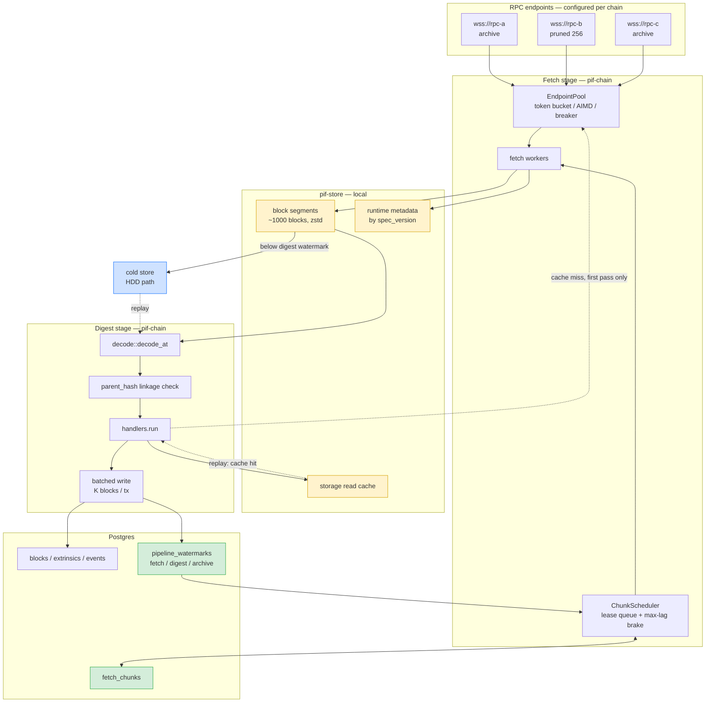
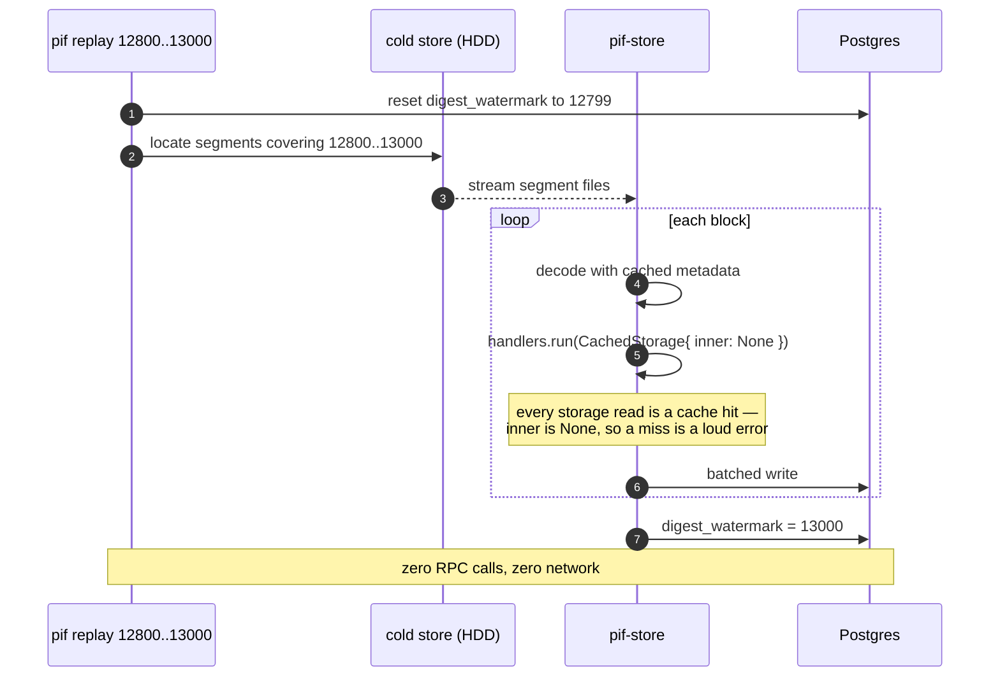
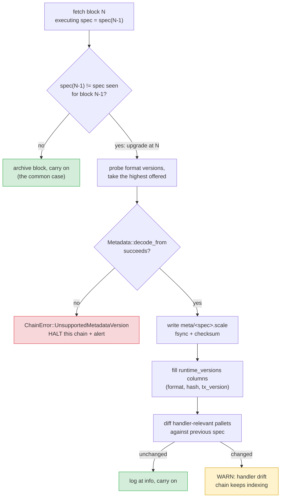
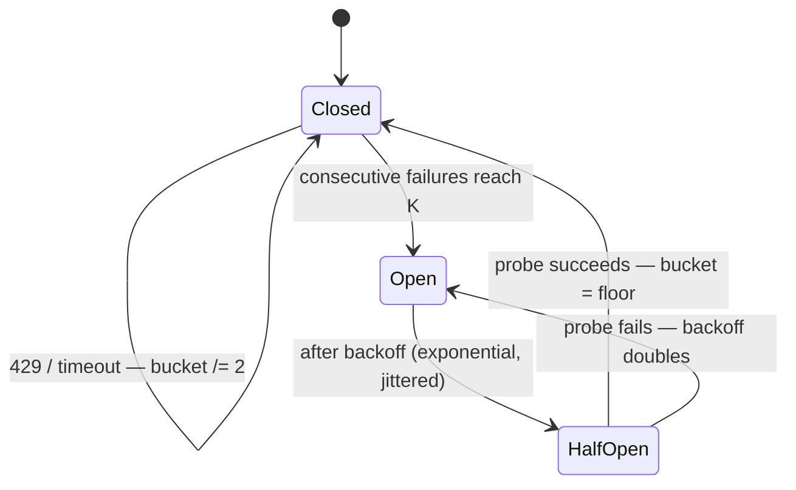

# IPD-002 — The Data Pipeline: fetch, digest, tier

| | |
|---|---|
| **Status** | Phases 0, 0.5, 1 and 2 shipped; 3–5 proposed |
| **Author** | Darwin Subramaniam |
| **Created** | 2026-08-15 |
| **Target** | Every chain reached over RPC (`ChainSource::Rpc`) |
| **New crate** | `pif-store` — hot block store, storage cache, cold tiering |
| **Affects** | `pif-core` (multi-endpoint config), `pif-chain` (pipeline split, endpoint pool), `pif-db` (batched writes, watermarks), `pif-cli` (new subcommands), `pif-api` (progress reports the digest watermark) |
| **Supersedes** | The README's *"Not yet implemented: Parallel historical backfill (`ArchiveBackend`)"* |
| **Load-bearing assumption** | Offline decode from archived bytes — **verified** against subxt 0.50.3, §9.1.1, and across a real runtime upgrade, §9.1.2 |
| **Found on the way** | A live defect: the indexer halted on any runtime upgrade (§9.1.2). **Fixed and shipped independently in `543a56f`** — phase 0.5, done. |

---

## 1. Summary

PIF fetches and processes a block in one indivisible step. `pipeline.rs:106-112` walks
`start..=catch_up_end` and, per number, resolves the block over RPC, decodes it, runs handlers
that make *further* RPC calls, and commits one Postgres transaction — before touching the next
number. Network latency, decode cost and database cost are welded into a single serial chain,
against a single endpoint that is assumed to be infinitely patient.

This proposal breaks that chain in two, and puts a **local block store** between the halves:

* a **fetch** stage pulls raw blocks from *several* RPC endpoints in parallel, under adaptive
  per-endpoint rate limiting, and appends them to local segment files;
* a **digest** stage reads only from those files, decodes, and writes to Postgres in batches;
* a **tiering** task moves digested segments from SSD to HDD, so history stays replayable at
  a tenth of the price per byte.

The payoff is not primarily speed. It is that **a re-index stops costing a re-download**.
Adding a handler, or fixing a decode bug, becomes a local operation over bytes you already
have.

---

## 2. Motivation

| Question | Today | After IPD-002 |
|---|---|---|
| The endpoint starts returning 429. What happens? | The error propagates out of `pipeline::run`; the chain's task logs `chain indexer stopped` and exits (`pif-cli/src/main.rs:126`). | The endpoint's token bucket halves, its circuit breaker may open, and its leased chunks return to the queue for another endpoint. Indexing slows; it does not stop. |
| I want to add the `identity` handler after indexing 5M blocks. | Re-fetch all 5M blocks from the network. | Re-digest from local segments. Zero RPC calls. |
| I found a bug in `decode.rs`. | Same — re-fetch everything. | Same — re-digest locally. |
| I have three RPC endpoints. Can I use them? | No. `ChainSource::Rpc { url: String }` holds exactly one. | Yes — a shared chunk queue, any healthy endpoint pulls from it. |
| The chain is 28M blocks and my SSD is small. | Not a question the indexer answers. | Digested segments tier to a configured HDD path; replay reads them back. |
| The chain performs a runtime upgrade. | ~~The indexer stops.~~ **Fixed in `543a56f`** — `decode_at` now resolves metadata at the block's parent (§9.1.2). Before that fix the upgrade block raised `ChainError::Decode` and the chain's indexer exited. | Unchanged by this proposal, which additionally records the executing runtime in the archive so a replay decodes the boundary too. |

> [!NOTE]
> Throughput is a *consequence* here, not the goal. The goal is that fetching and processing
> stop being the same event, so that each can fail, retry, and be redone without the other.

> [!NOTE]
> The last row was never a limitation this proposal introduced or an improvement it offered —
> it was a **defect present in the indexer**, found while verifying §9.1's assumptions and
> reproducible on any chain that upgrades. It is **fixed and merged** (`543a56f`), separately
> from everything else here, which is why it reads as history rather than as a promise.

---

## 3. The constraint that shapes the entire design

The obvious version of this proposal — *"cache the blocks locally, then process offline"* — is
**wrong**, and it is worth being precise about why before designing around it.

Handlers do not read only blocks. They read chain **state**. `crates/pif-chain/src/storage.rs`
says so in its own first paragraph:

> The dynamic core stores what *happened* in a block. Some pallets do not put what changed
> into the event at all — `pallet_identity` emits `IdentitySet { who }` with no display name
> […] For those, the event says *which key changed* and only storage says *what it changed to*.

And `crates/pif-identity/src/handler.rs:129` does exactly that, per block, during processing:

```rust
read::sync_account(storage, conn, chain_id, prefix, &account, block).await?;
```

`BlockContext.storage` is documented at `handlers.rs:36-42` as costing "an RPC round-trip
inside the block's transaction".

> [!IMPORTANT]
> **A block archive is not a state archive.**
> Storing raw blocks locally does not make the digest offline. It moves the RPC load rather
> than removing it — and moves it onto the single most expensive, most rate-limited call a
> public endpoint offers: **historical state on an archive node**.

Worse, it introduces a failure that does not exist today. A fetcher running 100k blocks ahead
of the digest means every storage read at digest time asks a node for state it discarded long
ago. Substrate defaults to `--state-pruning 256`; the indexer already has a dedicated error for
this (`ChainError::PrunedState`, raised via `decode.rs:99`'s `is_pruned_state`) precisely
because it is the failure people hit.

So the design has two non-negotiable consequences:

1. The hot store must archive **storage reads** alongside blocks (§6).
2. The fetcher must never outrun the digest by more than the endpoint's state window (§6.3).

Everything below follows from this.

---

## 4. Architecture



Amber = new local storage. Green = new Postgres state. Blue = the cold tier.

The dotted lines are the point of the whole proposal: on the **first** digest, a handler's
storage read misses the cache and goes to the network. On **every subsequent** digest of the
same block, it hits the cache and the network is never touched.

---

## 5. Sequence — backfill

Two loops that share nothing but the watermarks table. Neither blocks the other.

```mermaid
sequenceDiagram
    autonumber
    participant S as ChunkScheduler
    participant DB as Postgres
    participant W as fetch worker
    participant P as EndpointPool
    participant N as RPC endpoint
    participant HS as pif-store

    rect rgb(255, 243, 205)
    Note over S,HS: Fetch loop — parallel, N workers
    S->>DB: SELECT chunk WHERE state='pending'<br/>AND from_block under digest_wm + max_lag<br/>FOR UPDATE SKIP LOCKED
    DB-->>S: chunk [12800, 12927]
    S->>DB: UPDATE state='leased', lease_expires_at=now()+ttl
    S->>W: lease
    W->>P: acquire(endpoint)
    P-->>W: permit (or wait — bucket empty)
    loop each block in chunk
        W->>N: at_block(n) + header + events + extrinsics
        alt 429 / timeout
            N-->>P: rate limited
            P->>P: bucket /= 2, failures++
            Note over P: breaker opens after K failures;<br/>chunk returns to 'pending'
        else ok
            N-->>W: raw SCALE
            W->>HS: append(block bytes, events blob)
            opt spec_version unseen
                W->>N: state_getMetadata
                W->>HS: put_metadata(spec_version)
            end
        end
    end
    W->>HS: seal segment (fsync + index)
    W->>DB: UPDATE state='done'
    W->>DB: advance fetch_watermark
    end

    rect rgb(212, 237, 218)
    Note over HS,DB: Digest loop — serial, one per chain
    loop from digest_watermark + 1
        HS-->>HS: read block n from segment
        HS-->>HS: metadata for its spec_version
        Note over HS: decode::decode_at — no network
        HS->>HS: assert block[n].parent_hash == block[n-1].hash
        HS->>HS: handlers.run(ctx with CachedStorage)
        Note over HS,N: cache miss on first pass only
        HS->>DB: BEGIN — K blocks batched
        HS->>DB: UNNEST insert blocks / extrinsics / events
        HS->>DB: handler rows
        HS->>DB: advance digest_watermark
        HS->>DB: COMMIT
    end
    end
```

The `FOR UPDATE SKIP LOCKED` lease is what makes several workers — and, later, several
*processes* — safe against each other without a coordinator. A worker that dies simply lets
its lease expire, and the chunk returns to the pool.

---

## 6. The storage read cache

### 6.1 It needs no trait change

`StorageAt` (`crates/pif-chain/src/storage.rs:28`) is *already* a trait — deliberately, so
"a handler's tests can stub it with canned JSON and run with no node and no network". That
same property makes it decoratable:

```rust
/// `StorageAt` that answers from the local store, falling back to the node and
/// recording what it learned.
///
/// Lives in `pif-chain`, not `pif-store` — see §11.1.1.
pub struct CachedStorage<'a> {
    inner: Option<&'a dyn StorageAt>,   // None during a fully offline replay
    store: &'a StorageCache,            // pif-store's byte-level KV; knows no traits
    chain_id: &'a str,
    block: u64,
}

#[async_trait]
impl StorageAt for CachedStorage<'_> {
    async fn fetch(&self, pallet: &str, entry: &str, keys: Vec<Value>) -> Result<Option<Json>> {
        let k = CacheKey::new(self.chain_id, self.block, pallet, entry, &keys);
        if let Some(hit) = self.store.get(&k)? {
            return Ok(hit.into());          // includes cached *absence*
        }
        let Some(inner) = self.inner else {
            return Err(ChainError::StorageNotArchived { .. });
        };
        let value = inner.fetch(pallet, entry, keys).await?;
        self.store.put(&k, &value)?;
        Ok(value)
    }
    // has_pallet / block_number delegate; iter is not cached — see 6.2
}
```

No handler changes. `pif-identity` and `crates/example` compile untouched, because
`BlockContext.storage` is already `&dyn StorageAt` (`handlers.rs:42`).

> [!IMPORTANT]
> **Negative results must be cached.** `Ok(None)` — "this account has no identity" — is the
> *common* answer, not the exceptional one. A cache that only stores hits would re-hit the
> network on every replay for the overwhelming majority of reads, which is the same as having
> no cache at all.

### 6.2 What is deliberately not cached

`StorageAt::iter` — the bootstrap sweep over `Identity::IdentityOf` and friends. It is a
one-off, already guarded by the `identity_bootstrap` table, and it is tens of thousands of
keys that would dwarf the blocks themselves. A replay re-runs bootstrap against a node, or
skips it because the table says it already ran.

### 6.3 The max-lag brake

Because the cache is populated on the *first* digest, the digest must stay within the state
window of whatever endpoint serves it:

```
lease a chunk only if   chunk.from_block  <  digest_watermark + max_digest_lag
```

`max_digest_lag` defaults to **unbounded** when every configured endpoint reports `archive`,
and to **256** otherwise — matching Substrate's `--state-pruning 256` default, which
`docker-compose.yml` already documents as the reason the dev node runs
`--state-pruning=archive`.

This brake is also what stops the hot store growing without bound: the fetcher physically
cannot get more than `max_digest_lag` blocks ahead.

> [!WARNING]
> **The brake and a batched `fetch_watermark` deadlock each other.** Found while shipping
> phase 2, and it is not obvious from either half. The fetch stage advances the watermark in
> batches — an `fsync` per block would cost more than it buys — so with `max_digest_lag`
> below that batch size the fetcher stops to wait for a digest that is itself waiting for a
> watermark the fetcher has just stopped moving. Each blocked on the other, with nothing in
> either loop timing out to reveal it.
>
> The fix is one line of ordering: **publish before blocking**. Nothing more is archived
> while the brake is on, so one flush at the moment it engages is both necessary and
> sufficient. Anything that later batches watermark writes harder — a chunk queue, several
> fetch workers — has to preserve that rule, which is why it is written down here rather
> than left in the commit.
>
> `crates/pif-e2e/tests/pipeline_split.rs::a_tight_brake_does_not_deadlock_the_two_stages`
> drives `pif index` under a lag well below the batch size, and fails by timing out.

**The capability probe is behavioural, not declarative.** No RPC reports a node's pruning
mode, so `ChainClient::is_archive` resolves a block 300 behind the finalized head and reads
the answer: `PrunedState` means pruned, success means archive. It is biased towards
"pruned" — a chain shorter than the probe depth cannot distinguish the two, and guessing
"archive" wrongly costs the storage cache the state it was going to be built from, while
guessing "pruned" wrongly only holds the fetcher closer to the digest than it needs to be.

`is_pruned_state` (`decode.rs:99`) stays `pub(crate)`. The decorator that needs it lives in
`pif-chain` (§11.1.1), so it classifies the failure from inside the same crate — no public
API widens for this.

---

## 7. Sequence — replay, the payoff



`inner: None` is deliberate. During a replay we want a cache miss to be a **loud error**
(`StorageNotArchived`), not a silent fallback to the network — otherwise a replay quietly
becomes a re-download and nobody notices until the bill arrives.

---

## 8. Head-following

At the head there is no backfill and no parallelism to be had: finalized blocks arrive one
every ~6s from `stream_blocks()`. The same path is used anyway — the fetcher appends the
streamed block to the hot store, the digest picks it up — for two reasons: one code path
rather than two, and the head becomes replayable like everything else. The extra hop costs
well under a millisecond against a 6-second block time.

`follow_head`'s gap detection (`pipeline.rs:192`) re-derives its range from the cursor. That
read becomes the **fetch** watermark, not the digest watermark, or the fetcher would re-fetch
everything the digest has not yet caught up on.

> [!NOTE]
> **Only finalized blocks are stored.** That constraint (`pipeline.rs:29-32`) is unchanged and
> load-bearing: a finalized block cannot be reverted, so the hot store never needs
> invalidation. Anything that later fetches unfinalized blocks into the store must add it.

---

## 9. Data model

### 9.1 On disk — a map from block number to raw bytes

The block store is, logically, one thing:

```
u64 block number  →  RawBlock
```

The block number is the **primary key**, the ordering, and the digest's sequence, all at once.
Everything below is an encoding of that map, not a second data model.

```rust
/// Everything needed to decode block N with no network attached.
pub struct RawBlock {
    pub number: u64,              // the key
    pub hash: [u8; 32],
    pub spec_version: u32,        // selects the archived metadata that decodes this block
    pub transaction_version: u32, // `OfflineClient::at_block` resolves the pair, not just spec
    pub header: Vec<u8>,          // SCALE
    pub extrinsics: Vec<Vec<u8>>, // one blob per extrinsic, not one concatenated blob
    pub events: Vec<u8>,          // System::Events at N
}
```

| Field | Source | Cost |
|---|---|---|
| header | `at.block_header()`, then `.encode()` | free |
| *(metadata, archived per spec version — not per block)* | see §9.4.3.1 before choosing the RPC | one call per unseen `spec_version` |
| extrinsics | `Extrinsic::bytes()`, collected per extrinsic | **free** — in-memory slices |
| events blob | `Events::bytes()` | **free** — in-memory slice |
| block hash | `at.block_hash()` — already known | free |
| spec_version | `at.spec_version()` (`decode.rs:107`) | free |
| transaction_version | `at.transaction_version()` | free |

`extrinsics` is `Vec<Vec<u8>>` rather than one SCALE blob because that is the shape
`ExtrinsicsClient::from_bytes` accepts on the way back in. `transaction_version` is in the
list because `OfflineClient::at_block` resolves `(spec_version, transaction_version)` as a
pair and errors if either is missing — it is not needed for decoding, but it *is* needed to
construct the client that decodes.

Two fields in that list are easy to leave out and fatal to leave out.

> [!IMPORTANT]
> **The events blob is not part of the block.** `System::Events` is a *storage item* read at
> block N — which is exactly why `decode_at` fetches it separately (`decode.rs:117`). A store
> that keeps only header + extrinsics sends every replay back to an archive node for events,
> which is a re-download wearing a replay's clothes.
>
> **`spec_version` cannot be recovered from the block bytes.** `decode.rs` is entirely
> metadata-driven, so without it a stored block names no decoder. Four bytes per block buys
> a direct lookup into `meta/<spec_version>.scale` and avoids maintaining a separate
> block-range → runtime map.

The hash is stored even though the spike showed it is **re-derivable**: decoding the archived
header, re-encoding it and hashing with `at.hasher()` reproduced `at.block_hash()` on every
block tested. Keeping the field is a 32-byte insurance policy against the one place a silent
round-trip failure would surface — as a fabricated `ChainLinkageBroken` in §10.2 — not a
correction of a known defect.

**Runtime metadata must be captured as bytes off the wire.** `subxt_metadata::Metadata`
implements `Decode` but **not** `Encode`, so the already-decoded metadata a live client holds
cannot be re-serialised into the archive. The fetch stage has to ask the node for metadata when
it meets an unseen `spec_version` — the one extra RPC call this design adds, amortised across
every block of a runtime. **Which RPC, and therefore which metadata format version, is a
decision with permanent consequences — see §9.4.3.1 before wiring `state_getMetadata` in.**

> [!WARNING]
> **"Amortised" is a design obligation, not a given.** Westend metadata is **~400 KB**
> (436,658 bytes at spec 1022002; 392,505 at 1024001). A fetch worker that builds an
> `OnlineClient` per block pays that on every block, because `OnlineClient::from_rpc_client`
> downloads full metadata on construction — turning a few kilobytes of archived block into
> hundreds of kilobytes of transfer, plus a WebSocket handshake each time.
>
> This is not hypothetical: the first version of the test harness did exactly that, and
> capturing 40 small blocks moved on the order of 32 MB. Fixing it — one connection, metadata
> cached by `spec_version` — took the same work from roughly 0.4–0.5 s per block to
> unmeasurable: **7 blocks in 24.8 s, then 33 blocks in 24.2 s**, the remaining time being a
> fixed wait for transaction finality rather than anything per-block.
>
> So `EndpointPool` (§10) must hold connections open, and the metadata cache is not an
> optimisation to add later — without it the fetch stage is dominated by re-downloading a
> runtime description that changes a handful of times a year.

> [!WARNING]
> **Keying by number is correct only because the store holds finalized blocks exclusively**
> (§8). Under a fork, block *number* is not unique — block *hash* is. This is a precondition,
> not an incidental property: anything that later fetches unfinalized blocks into the store
> gets a silent key collision rather than an error, and must re-key by hash first.

> [!IMPORTANT]
> **Raw bytes cost zero extra RPC calls.** Verified against subxt 0.50.3: `Events::bytes()`
> and `ExtrinsicDetails::bytes()` are slices of buffers `decode_at` (`decode.rs:117,126`)
> already fetches and already pays for. The hot store rides along on the fetch that happens
> anyway.
>
> The **inverse** — reconstructing `Events` and `Extrinsics` *from bytes plus metadata, with
> no client attached* — is what `decode_stored` (§11.3) needs and is the single assumption
> this entire proposal rests on. It is now **verified**, not assumed; see §9.1.1.

#### 9.1.1 Spike result — offline decode works

`crates/pif-e2e/tests/decode_stored_spike.rs`, run against a zombienet dev node. It captures a
`RawBlock` from a live node, drops the connection, rebuilds the block through `OfflineClient`,
and compares every primitive `decode_at` shapes its rows from: per event `(index, pallet,
variant, phase, field_bytes)`, per extrinsic `(index, pallet, call, hash, is_signed,
address_bytes, call_data_field_bytes)`.

**40 blocks per run, byte-identical, including blocks carrying a signed
`Balances::transfer_allow_death`** submitted by the test itself — the idle dev chain produces
only inherents, and a spike that never exercises an address, a signature or transaction
extensions proves less than it claims (§14).

The API surface that makes it work, all present in subxt 0.50.3:

| Need | API |
|---|---|
| events from bytes | `EventsClient::from_bytes(Vec<u8>) -> Events<T>`, bound on `OfflineClientAtBlockT` |
| extrinsics from bytes | `ExtrinsicsClient::from_bytes(Vec<Vec<u8>>)`, same bound |
| a client with no network | `OfflineClient::new_with_config(cfg).at_block(n)` |
| metadata into that client | `PolkadotConfig::builder().set_metadata_for_spec_versions([(v, meta)]).set_spec_version_for_block_ranges([…])` |
| metadata from bytes | `subxt::metadata::Metadata::decode_from(&[u8])` |

Reproduce with a node on `ws://127.0.0.1:9944` (override with `PIF_TEST_NODE_URL`):

```sh
cargo test -p pif-e2e --test decode_stored_spike -- --ignored --nocapture
```

**Why compare a projection rather than two `BlockData`s.** Every field of
`NewBlock`/`NewEvent`/`NewExtrinsic` is a pure function of exactly the primitives listed
above — `extract_fee` and `extract_timestamp` read decoded fields, `encode_signer` reads
`address_bytes`, outcomes are matched by event index. If the primitives are byte-identical
the rows cannot differ, and comparing them directly keeps the spike independent of
`decode_at`'s current shape, so it stays valid across the §11.3 refactor.

##### Structural findings

* **`block_header()` and `block_hash()` are on the *online* impl only** (`client.rs:150+`).
  Every other accessor `decode_at` uses — `block_number`, `spec_version`,
  `transaction_version`, `events`, `extrinsics`, `hasher` — is available offline. This is
  precisely why the header and hash must be archived rather than asked for.
* **`OnlineClientAtBlockT<T>: OfflineClientAtBlockT<T>`** — the online trait is a *subtype* of
  the offline one. So a decode core generic over `C: OfflineClientAtBlockT<T>` serves both
  paths from one body, which is what makes §11.3's "sharing all of its field-shaping code"
  real rather than aspirational. The spike's comparison function is written exactly that way
  and compiles against both client types unchanged.
* **The offline client validates no chain identity.** `OfflineClient::at_block` stores
  `config.genesis_hash()` without checking it against anything, and `PolkadotConfigBuilder`
  does not even expose a setter for it — so during a replay it is `None`. Decoding does not
  need it, but the consequence is that `guard_chain_identity` (`pipeline.rs:310`) has **no
  offline counterpart**: a replay pointed at the wrong chain's segments would decode happily.
  The `parent_hash` linkage check (§10.2) is the only defence on the replay path, which
  upgrades it from "nice consistency check" to the sole guard.

##### API gotchas worth writing down

Each of these cost a compile-fix or a source dive; none is in subxt's docs prominently.

* **`PolkadotConfig` does not implement `RpcConfig`.** `LegacyRpcMethods` — needed for
  `state_getMetadata` — must be parameterised as
  `LegacyRpcMethods::<RpcConfigFor<PolkadotConfig>>::new(rpc)`. `RpcConfigFor<T>` is the
  bridge type in `subxt::config`.
* **Never call `use_known_spec_versions()` on the offline config.** It hardcodes the *live
  Polkadot relay chain's* spec-version ranges; subxt's own doc comment warns it "will lead to
  obscure errors" against anything else. The archive knows the exact spec version per block,
  so `set_spec_version_for_block_ranges` with the stored value is both correct and narrower.
* **`PolkadotConfigBuilder::new()` defaults `use_historic_types = true`**, which loads
  `frame_decode::legacy_types::polkadot::relay_chain()` at `build()`. Harmless for V14+
  metadata, which never consults it — but it is Polkadot-relay-specific, so a non-Polkadot
  chain serving pre-V14 metadata would be decoded against the wrong type registry. Worth
  disabling explicitly for chains that are not the relay chain.
* **`ExtrinsicsClient::from_bytes` is `async`** despite touching no network, so
  `decode_stored` is an `async fn` too — a wart, not a cost.
* **subxt's extrinsic error is >128 bytes**, so `xs.iter().map(...).collect::<Result<_,_>>()`
  trips clippy's `result_large_err`. Collect extrinsic bytes in a plain loop; the digest loop
  in §11.3 will hit the same thing.

##### What the spike does *not* cover

Stated so the next person does not over-read it:

* ~~**One runtime.**~~ Now covered — and it found a live defect. See §9.1.2.
* **V14+ metadata only.** Legacy-type decoding of pre-V14 runtimes is untouched, which matters
  for backfilling early Polkadot history.
* **A dev chain, not an archive node.** Blocks were 2–3 extrinsics and ~30–320 bytes of events;
  nothing here says anything about throughput or segment sizing.

#### 9.1.2 The upgrade block — a defect that already existed *(fixed)*

> [!NOTE]
> **This was never a finding about the proposal. It was a bug in the indexer, and it halted
> any chain the moment that chain upgraded its runtime.**
>
> **Status: fixed in `543a56f`**, shipped on its own without any other part of this proposal.
> The section is kept in full because the reasoning is what stops the same mistake being made
> again — in the fetch stage, in the archive, or in `runtime_versions.first_seen_block`
> (§9.4.6), each of which has to make the identical parent-versus-block choice.

Closing §9.1.1's "one runtime" gap meant performing a real forward runtime upgrade
(westend `1022002 → 1024001`) and archiving blocks either side of it. The first attempt did
not fail in the archive. It failed in subxt, on the live chain, decoding a block that
*existed*:

```
Can't decode event topics: Not enough data to fill buffer
```

Block-by-block, decoding each block's events with its own reported metadata versus its
parent's:

| block | own spec | parent spec | own metadata | parent metadata |
|---|---|---|---|---|
| 36 | 1022002 | 1022002 | OK (2 events) | OK (2 events) |
| 37 | 1022002 | 1022002 | OK (2 events) | OK (2 events) |
| **38** | **1024001** | **1022002** | **FAILS** | **OK (8 events)** |
| 39 | 1024001 | 1024001 | OK (6 events) | OK (6 events) |
| 40 | 1024001 | 1024001 | OK (2 events) | OK (2 events) |

**Why.** The block carrying `set_code` is *executed* by the old runtime — Substrate defers the
swap so the new code takes effect from the *next* block. Its events and extrinsics are
therefore encoded against the **old** metadata. But that block's post-state already holds the
new `:code`, so `state_getRuntimeVersion(hash_N)` and `state_getMetadata(hash_N)` both report
the **new** runtime. Ask the node "what runtime is this block?" and it truthfully answers with
the one that cannot decode it.

> [!IMPORTANT]
> **The rule: decode block N with the runtime reported at N − 1.**
>
> Uniform, and it needs no special case for the upgrade block. Away from a boundary the parent
> and the block report the same version, so the rule changes nothing; at a boundary it is the
> only correct answer. Genesis has no parent and executed nothing, so it stands for itself.

**What this broke.** `decode_at` read `at.spec_version()` and decoded through the metadata
subxt resolved for that same block. On any real runtime upgrade it raised
`ChainError::Decode`, `pipeline::run` propagated it, and `pif-cli/src/main.rs:126` logged
`chain indexer stopped` and exited — the exact failure §2 opens with, unhit for years only
because no test had ever upgraded a runtime under the indexer.

**What the fix does** (`543a56f`). `executing_runtime()` resolves the block's parent via
`header.parent_hash`; genesis stands for itself. Then:

* **Events** are taken as a raw blob from the block and decoded with the executing runtime.
  `Events::bytes()` performs no decoding, so this works on every transport — and events are
  the half that actually fails, since an upgrade reshapes the event enum far more often than
  it renumbers calls.
* **Extrinsics** keep the previous path whenever the block and its parent share a runtime, so
  the common case costs nothing extra. Only at an upgrade block is the raw body fetched via
  `chain_getBlock` and decoded with the parent's metadata. That asymmetry is forced: subxt
  exposes no way to read the bytes back out of an `Extrinsics` without first decoding them,
  which is precisely what cannot be done with the wrong metadata.
* `NewBlock.spec_version` now records the **executing** runtime. Identical for every block but
  an upgrade block, and those were never successfully indexed, so no existing row changes
  meaning.
* New `ChainError::UpgradeBlockBodyUnavailable`. `chain_getBlock` is a legacy RPC a light
  client does not serve, so a light client meeting an upgrade block now gets a named
  limitation instead of a silent mis-decode.

It was not, in the end, the one-line change it looked like — the extrinsic path had no
metadata-free way back to the bytes.

**How deep it goes.** subxt's own transaction path has the same assumption:
`wait_for_success()` on the `set_code` extrinsic fails with the identical error, because it
reads the block's events. The upgrade test cannot use it and confirms the upgrade by polling
the runtime version instead — evidence that does not require decoding the upgrade block.

**Consequence for `RawBlock`.** `spec_version` is the version of the runtime that *executed*
the block, captured at its parent — not the version the node reports for it. Archiving the
reported version would store the wrong decoder for exactly one block per upgrade, and a replay
would fail on it forever after, long past the point where the mistake could be traced. The
field is documented that way in `tests/common/offline.rs`.

**Verified end to end** by `crates/pif-e2e/tests/upgrade_boundary.rs`: 9 blocks archived across
spec versions `[1022002, 1024001]`, signed extrinsics on both sides, decoded through **one**
offline client holding both metadata versions:

```
set_code applied in block 10 · spec_version 1022002 -> 1024001
block  6 spec 1022002: 7 events, 3 extrinsics (1 signed) — online and offline identical
block 10 spec 1022002: naive online decode FAILED; archive decoded it anyway — 8 events
block 14 spec 1024001: 9 events, 3 extrinsics (1 signed) — online and offline identical
```

The test asserts that the naive per-block-metadata path *does* fail, rather than merely that
the archive succeeds. If subxt ever starts resolving the executing runtime itself, that
assertion fires and the rule gets revisited deliberately instead of being quietly dropped.

**Raw, not decoded — on purpose.** Decoding is the part most likely to have bugs, and it is
the part a replay exists to redo. Archiving `BlockData` would freeze today's decoder into the
archive and forfeit the main benefit. For the same reason runtime metadata is archived per
`spec_version`.

#### Physical layout — segments, addressed by number

```
<hot_path>/<chain_id>/blocks/000012800-000013799.seg     ~1000 blocks, zstd frames
<hot_path>/<chain_id>/blocks/000012800-000013799.idx     u64 block → (offset, len)
<hot_path>/<chain_id>/storage/…                          read cache
<hot_path>/<chain_id>/meta/<spec_version>.scale          runtime metadata
```

Segment files rather than one file per block or an embedded KV. One file per block is 28M
inodes on Polkadot; an embedded KV gives up the other three properties. Segments keep tiering
to cold storage a **file copy** rather than a range scan-and-delete, keep replay a
**sequential** read — the difference between usable and unusable on an HDD — and stay
inspectable with ordinary tools.

Because segments are fixed-size and aligned, **the path is computed, never looked up**:

```
segment_index = number / segment_size
```

`get_block(n)` resolves to a file without consulting Postgres. The `.idx` sidecar is the
in-segment offset map — the physical form of the same `u64 →` key. This is what lets the
`segments` table shrink to bookkeeping (§9.2).

> [!NOTE]
> **The storage read cache does not share this key scheme.** It is keyed by
> `(chain_id, block, pallet, entry, keys)` (§6.1) and lives in its own store. Number-keyed
> block archival delivers offline replay for the *dynamic core* only; handlers that read state
> need phase 2 as well. The two stores are siblings under `<hot_path>`, not one store with two
> key shapes.

**Sizing, so the HDD can be bought before it is needed.** Polkadot is ~28M blocks at roughly
5–15 KB raw per block with events: on the order of 200–400 GB uncompressed, 60–120 GB with
zstd. The storage read cache for a state-heavy handler such as `identity` can exceed the
blocks themselves; budget for it separately.

### 9.2 In Postgres — new tables

These are framework tables, so they land in a new root migration `migrations/0002_pipeline.sql`
(`pif_db::MIGRATOR` embeds the whole `migrations/` directory via `sqlx::migrate!`).

```sql
-- Replaces the dual meaning of indexer_state.last_indexed_block.
CREATE TABLE pipeline_watermarks (
    chain_id         TEXT PRIMARY KEY REFERENCES chains(id) ON DELETE CASCADE,
    fetch_watermark  BIGINT NOT NULL,          -- highest contiguous block in the hot store
    digest_watermark BIGINT NOT NULL,          -- highest block committed to Postgres
    archive_watermark BIGINT NOT NULL,         -- highest block moved to cold storage
    updated_at       TIMESTAMPTZ NOT NULL DEFAULT now(),
    CHECK (archive_watermark <= digest_watermark),
    CHECK (digest_watermark  <= fetch_watermark)
);

-- The work queue. Leases, not assignments.
CREATE TABLE fetch_chunks (
    chain_id         TEXT   NOT NULL REFERENCES chains(id) ON DELETE CASCADE,
    from_block       BIGINT NOT NULL,
    to_block         BIGINT NOT NULL,
    state            TEXT   NOT NULL DEFAULT 'pending',   -- pending | leased | done | failed
    leased_by        TEXT,                                -- endpoint url
    lease_expires_at TIMESTAMPTZ,
    attempts         INTEGER NOT NULL DEFAULT 0,
    last_error       TEXT,
    PRIMARY KEY (chain_id, from_block),
    CHECK (state IN ('pending','leased','done','failed'))
);
CREATE INDEX fetch_chunks_claimable_idx ON fetch_chunks (chain_id, from_block)
    WHERE state = 'pending';
CREATE INDEX fetch_chunks_expiry_idx ON fetch_chunks (lease_expires_at)
    WHERE state = 'leased';

-- NOTE: the same migration also ALTERs the existing `runtime_versions` table rather than
-- adding a table for archived metadata — see §9.4.6 for why a second one would be wrong.

-- Which tier a segment is on, and whether it is intact. NOT a lookup index:
-- the hot path is computed from the block number (§9.1).
CREATE TABLE segments (
    chain_id    TEXT   NOT NULL REFERENCES chains(id) ON DELETE CASCADE,
    from_block  BIGINT NOT NULL,
    to_block    BIGINT NOT NULL,
    tier        TEXT   NOT NULL DEFAULT 'hot',            -- hot | cold
    bytes       BIGINT NOT NULL,
    checksum    BYTEA  NOT NULL,
    sealed_at   TIMESTAMPTZ NOT NULL DEFAULT now(),
    PRIMARY KEY (chain_id, from_block),
    CHECK (tier IN ('hot','cold'))
);
```

`segments.path` is gone deliberately. With fixed-size, aligned segments the hot path is
`segment_index = number / segment_size`, so `get_block(n)` needs no database round-trip at
all — and a store whose location is *computed* cannot drift out of sync with a table that
records where it was supposed to be. What remains is bookkeeping the filesystem genuinely
cannot answer: which tier a segment is on, and its checksum. `cold_path` comes from config
(§10.1), so the cold location is computed the same way.

> [!IMPORTANT]
> **`fetch_watermark` is the highest *contiguous* block, never the highest present.** Parallel
> chunk fetch means block 5000 can land before 4000. A digest loop that asks "does key N+1
> exist?" will step straight over the hole and record a gap as success — and the number-keyed
> framing makes that mistake very natural to write. Two rules keep it structural:
>
> * the digest advances only while `n <= fetch_watermark`;
> * only chunk *completion* advances `fetch_watermark`, and only over a contiguous run.
>
> Key existence is not readiness. The `CHECK (digest_watermark <= fetch_watermark)` above is
> the last line of defence, not the first.

The existing cursor table is **`indexer_state`** (`migrations/0001_core.sql:85`), *not*
`cursors`. It is kept and continues to be written by `repo::update_cursor`, mirroring
`digest_watermark`, so that `pif-api`'s progress query and any external consumer keep working
through the transition. `pipeline_watermarks` becomes the authority.

### 9.3 The watermark split, and what it breaks

`indexer_state.last_indexed_block` currently means both "fetched" and "processed" — the same
number, because they were the same event. Once split:

| Reader | Today | After |
|---|---|---|
| `follow_head` gap detection (`pipeline.rs:192`) | `load_cursor` | **fetch** watermark |
| `pipeline::run` catch-up start (`pipeline.rs:79`) | `load_cursor` | **fetch** watermark |
| GraphQL indexing progress | `indexer_state` | **digest** watermark — anything else advertises blocks whose rows do not exist yet |
| Tiering task | — | never below `digest_watermark − retention_margin` |

---

### 9.4 The metadata registry, and what an upgrade should actually do

§9.1.2 establishes that every block names the runtime that executed it. The natural next
question is whether the indexer should therefore *keep every runtime it has ever seen*, decode
old blocks dynamically against the right one, and shout when it meets something it cannot
handle. Yes to all three — but the third needs a distinction that is easy to miss, because
getting it wrong produces either a monthly false alarm or a silent failure.

#### 9.4.1 A runtime upgrade does not require an indexer upgrade

This is the framework's central property, stated in `decode.rs`'s own first paragraph:

> Nothing here is compiled against a specific runtime. Pallet names, call names, event names
> and field shapes all come from the metadata the node reports *for that block*, so the same
> code indexes any Substrate chain and keeps working across runtime upgrades.

So a `spec_version` bump — Polkadot does roughly one a month — is a **non-event** for the
dynamic core. New pallet, renamed call, extra event field: all of it arrives as metadata and
is decoded without a recompile. An alert that fires on every runtime upgrade saying "the
indexer should be upgraded" would be wrong twelve times a year, and the thirteenth time,
when it mattered, nobody would read it.

What *can* force an upgrade is a change in the **metadata format version** — a different thing
entirely, and far rarer.

| Signal | Frequency | What it means | Action |
|---|---|---|---|
| `spec_version` changes | ~monthly | Ordinary runtime upgrade | **None.** Archive the new metadata under its version, keep indexing. Log at `info`. |
| Metadata format V14 → V15 → V16 | every few years | Format evolution | **None**, while subxt supports the new one — it currently supports V14, V15 and V16. |
| Metadata format beyond subxt's support | rare | The chain moved past our decoder | **Halt this chain and alert.** This is the genuine "upgrade the indexer" case. |
| Metadata below V14 | historical | Pre-V14 blocks during deep backfill | Needs a legacy type registry (§9.4.3), not an upgrade. |
| A *handler's* assumption breaks | occasional | e.g. `pallet_identity` renames a field | Dynamic core is fine; the typed overlay may silently mis-project. §9.4.4. |

#### 9.4.2 The registry already half exists — it just does not persist

subxt caches metadata per spec version in the `Config` itself. `OnlineClient` looks up
`Config::metadata_for_spec_version` (`online_client.rs:399`) and, on a miss, fetches and calls
`Config::set_metadata_for_spec_version` (`online_client.rs:502`). Because `ChainClient` builds
one `OnlineClient` per chain and keeps it (`client.rs:44`), a long-running indexer already
accumulates every runtime it meets.

Two things are missing, and both are things this proposal was going to build anyway:

* **Persistence.** The cache dies with the process, so a restart re-downloads ~400 KB per spec
  version. §9.1's `meta/<spec_version>.scale` *is* the durable form of this cache. The
  registry is not a new component — it is the metadata directory, loaded into the config at
  startup via `set_metadata_for_spec_versions` instead of being refetched.
* **Authority during replay.** A replay has no node to ask. The archive must be the only
  source, which is what §7's `inner: None` already demands of storage reads and what
  `offline_client_for` in `tests/common/offline.rs` already demonstrates for metadata.

> [!NOTE]
> This makes `meta/` load-bearing in a way §9.1 understates. Losing a `spec_version`'s metadata
> makes every block that ran under it permanently undecodable, even though the block bytes are
> intact. It is a handful of megabytes for a chain's entire history — replicate it, checksum
> it, and never let a retention policy near it.

#### 9.4.3 Very old runtimes: `frame-decode`, already in the tree

Pre-V14 metadata carries no type information, so decoding those blocks needs an external type
registry. `frame-decode` — already a transitive dependency via subxt — provides exactly this
through `scale_info_legacy::ChainTypeRegistry`:

| Source | Covers |
|---|---|
| `frame_decode::legacy_types::polkadot::relay_chain()` | Polkadot relay chain |
| `frame_decode::legacy_types::kusama::relay_chain()` / `::asset_hub()` | Kusama relay, Kusama Asset Hub |
| `frame_decode::legacy_types::from_bytes(&yaml)` | anything else, from a YAML registry you supply |

`Config::legacy_types_for_spec_version` is the hook subxt calls for them, and
`PolkadotConfigBuilder` wires the Polkadot set in by default (§9.1.1 notes this default is
Polkadot-relay-specific and wrong for other chains). For a chain outside that list, deep
backfill needs a supplied YAML registry — which belongs beside `meta/` in the store, not
compiled in.

**Ops tooling, not runtime dependency.** Two, and they do different jobs:

* **`subxt metadata`** — first-party, already installed alongside the workspace. `-f bytes` is
  the **default** and emits raw SCALE, exactly the archive's format:

  ```sh
  subxt metadata --url wss://rpc.polkadot.io -f bytes -o meta.scale
  subxt metadata --url ws://127.0.0.1:9977 -a --at-block <hash> -o meta.scale   # historic
  subxt metadata --url ws://127.0.0.1:9977 -a --version 15 -o meta_v15.scale    # pick format
  ```

  `--at-block` is the one that matters here: it makes backfilling a metadata registry from an
  archive node a shell loop rather than a program. Verified working against the
  upgrade-boundary node. (`-a`/`--allow-insecure` is needed for plain `ws://`.)
* [**`subwasm`**](https://github.com/chevdor/subwasm) — third-party. Fetches the runtime *wasm*
  at a block hash, extracts metadata, prints version info, and `diff`s two runtimes. The
  `diff` is what §9.4.4 wants for judging whether an upgrade touched anything a handler cares
  about.

Neither belongs in the indexing path — the indexer gets metadata from the node it is already
connected to. Both belong in the operator's hands when something looks wrong.

#### 9.4.3.1 A runtime serves *several* metadata formats — pick deliberately

Probing the same runtime (westend `1022002`) for each format version:

| Request | Result |
|---|---|
| `state_getMetadata` (the legacy RPC) | **436,658 bytes — format V14** |
| `--version 14` | 436,658 bytes, V14 |
| `--version 15` | 473,289 bytes, V15 |
| `--version 16` | 481,527 bytes, V16 |
| `--version 17` / `unstable` | not available |
| default (`latest stable`) | 481,527 bytes, **V16** |

> [!WARNING]
> **§9.1 currently specifies `state_getMetadata`, which silently pins the archive to V14 — the
> oldest format the chain offers.** That is a real choice being made by accident.
>
> V14 decodes blocks perfectly well, and it is the most universally available. But V15 added
> runtime API descriptions and outer enum types, and V16 more again; a handler that later
> wants a runtime API finds V14 cannot describe one. **The archive is permanent and the
> decision is irreversible**: once the archive node that served a historical block is gone,
> the richer metadata for that spec version can never be obtained again.
>
> The recommendation is therefore to archive the **highest format the node offers** — falling
> back down the ladder when a request fails, and recording which version was stored — rather
> than whichever version the convenient RPC happens to return. `Metadata::decode_from` accepts
> V14, V15 and V16 identically, so this costs nothing at decode time and buys optionality that
> cannot be bought later.
>
> The version probe is also the §9.4.4 detector, for free: the day `--version 17` starts
> succeeding is the day to check whether subxt can read it.

#### 9.4.4 The alert that is actually worth sending

Not "a runtime upgraded" — that is routine. Two things are worth a human's attention:

1. **Unsupported metadata format.** `subxt_metadata` fails with a distinguishable message:
   `RuntimeMetadata version {n} cannot be decoded from`. That deserves a dedicated
   `ChainError::UnsupportedMetadataVersion { chain, spec_version, metadata_version }` rather
   than being flattened into `ChainError::Decode`, because it is the one failure whose fix is
   "upgrade subxt and redeploy" rather than "retry".
2. **Handler-relevant metadata drift.** The dynamic core cannot break, but a typed handler can:
   `pif-identity` reads `Identity::IdentityOf` and matches on event field names, and a runtime
   that renames one produces rows that are wrong rather than absent. Because the registry holds
   both versions, this is checkable — on first sight of a new `spec_version`, diff the pallets
   and events the registered handlers actually use, and warn on a change. That is a far more
   useful notification than the upgrade itself, and it is only possible *because* every spec
   version is kept.

Both are cheap, and both are strictly better than the status quo, where a runtime upgrade
stops the chain outright (§9.1.2).

#### 9.4.5 `#[subxt::subxt(runtime_metadata_path = …)]` — not in the indexing path, but useful

subxt's headline example generates a typed interface at compile time from one metadata file:

```rust
#[subxt::subxt(runtime_metadata_path = "/path/to/polkadot_rc_metadata.scale")]
mod polkadot {}
```

> [!WARNING]
> **This must never enter the indexing path.** It bakes one runtime's shape into the binary.
> PIF's central property — "the same code indexes any Substrate chain and keeps working across
> runtime upgrades" — exists precisely because pallet, call and event names are resolved from
> metadata at runtime. Adopting the macro would make every monthly `spec_version` bump a
> regenerate-and-redeploy, which is the failure §9.4.1 argues against, arriving twelve times a
> year. The repo contains no `subxt::subxt` invocation today, and that is a deliberate
> property worth defending.
>
> `runtime_metadata_insecure_url` is worse again: it downloads metadata from a node *at compile
> time*, making builds non-reproducible and dependent on whatever that node currently runs.
> subxt's own documentation recommends against it.

**Where it earns its place is as a compile-time contract for the typed overlay**, and the
archive is what makes that possible.

The dynamic core cannot break on a runtime upgrade. A *handler* can, silently. `pif-identity`
resolves everything by string:

```rust
pub const PALLET: &str = "Identity";                       // read.rs:19
storage.fetch(PALLET, "IdentityOf", key())                 // read.rs:41
info.get("display")  info.get("legal")  info.get("web")    // model.rs:142-144
raw.get("judgements")   value.get("provider")   item.get("fee")
```

Every one of those is a runtime lookup that yields `None` if the name changes. A renamed field
does not raise an error — it produces a row with a null display name, indistinguishable from an
account that genuinely set none. That is the worst failure shape available: silent, plausible,
and discovered months later.

Pointing the macro at an **archived** `meta/<spec_version>.scale`, in a test target only, turns
that into a build failure:

```rust
// crates/pif-identity/tests/metadata_contract.rs — NOT compiled into the indexer.
#[subxt::subxt(runtime_metadata_path = "../../.pif-store/polkadot/meta/1024001.scale")]
mod runtime {}

// Fails to compile if `Identity::IdentityOf` is renamed or reshaped.
#[test]
fn identity_storage_shape_is_what_the_handler_assumes() {
    let _ = runtime::storage().identity().identity_of(&AccountId32([0u8; 32]));
}
```

This is the same check §9.4.4 proposes doing by diffing at runtime, moved to compile time where
it is cheaper and louder. The two are complements: the runtime diff catches drift on a chain
you are indexing *now*, the compile-time contract catches it before the deploy.

Three honest caveats. It only checks what assertions are written against, so it is a tripwire
rather than a proof. It generates a large amount of code, so it belongs in a test target where
its compile cost is not paid on every build. And it verifies the *metadata* shape, not the JSON
keys handlers actually read — those come from `pif_core::codec`'s rendering of the same field
names, so the correspondence is close but not automatic.

> [!NOTE]
> This is the one place the metadata archive pays off for something other than replay: it gives
> the build a stable, versioned, checked-in artifact to compile against. Without §9.1's `meta/`
> directory there would be nothing to point `runtime_metadata_path` at except a file someone
> downloaded by hand.

#### 9.4.6 Runbook — what actually happens when the spec changes

The sections above give the principles. This is the sequence, and the short answer is: **the
indexer does six things, and a human does nothing.** The exceptions are the last two rows of
the table below, and only those.

**Detection.** The fetcher already resolves each block's executing runtime at its parent
(§9.1.2), so it holds `spec_version(N-1)` for the block it is working on and the value it saw
for the previous block. An upgrade is simply those two disagreeing — no polling, no extra call.
The block where they disagree *is* the upgrade block, the one whose events are encoded against
the older runtime.



Note what is *not* on that diagram: re-fetching anything, pausing the digest, or restarting.
Block N decodes with the old runtime, N+1 onward with the new, and the watermarks never move
backwards.

**The boundary gets recorded**, so the archive is self-describing and a replay never has to
re-derive the block → runtime map from a node it may no longer have.

**This needs no new table.** An earlier draft of this proposal invented `runtime_upgrades`,
which was a mistake: `runtime_versions` already exists (`migrations/0001_core.sql:25`), with
the *same* primary key and the *same* grain — one row per `(chain_id, spec_version)`.

```sql
-- migrations/0001_core.sql:25 — already shipped, already maintained.
CREATE TABLE runtime_versions (
    chain_id         TEXT    NOT NULL REFERENCES chains(id) ON DELETE CASCADE,
    spec_version     INTEGER NOT NULL,
    spec_name        TEXT    NOT NULL,
    first_seen_block BIGINT  NOT NULL,
    PRIMARY KEY (chain_id, spec_version)
);
```

Two tables at the same grain would have to agree about which block a runtime started at, and
the day they disagreed the archive would be the one that was wrong. So `0002_pipeline.sql`
**extends** it rather than shadowing it:

```sql
-- What the archive knows about each runtime, beyond the fact that it existed.
ALTER TABLE runtime_versions
    ADD COLUMN transaction_version INTEGER,     -- with spec_version, what OfflineClient::at_block needs
    ADD COLUMN metadata_version    SMALLINT,    -- 14 | 15 | 16 — which format was archived (§9.4.3.1)
    ADD COLUMN metadata_hash       BYTEA,       -- integrity, and detects a spec served two ways
    ADD COLUMN metadata_archived_at TIMESTAMPTZ;
```

All four are **nullable on purpose**. `NULL` is not missing data, it is a fact worth being
able to query: *this runtime was indexed, but its metadata is not in the archive* — true of
every row written before the store existed, and a precise answer to "which ranges can I
actually replay?"

```sql
-- Ranges that will fail a replay, and why.
SELECT chain_id, spec_version, first_seen_block
FROM runtime_versions
WHERE metadata_hash IS NULL
ORDER BY chain_id, first_seen_block;
```

> [!IMPORTANT]
> **`first_seen_block` is the block *after* the one carrying `set_code`** — the first block the
> new runtime actually executed. The upgrade block itself belongs to the **previous** row.
> Getting this backwards reintroduces §9.1.2's defect in table form, where it is much harder
> to see.
>
> The existing writer already gets this right, and got it right *for free* from `543a56f`.
> `write_block_in_tx` (`repo.rs:125`) inserts `(block.spec_version, block.number)` with
> `ON CONFLICT DO NOTHING`, and since the fix `block.spec_version` is the **executing**
> runtime. So the upgrade block re-asserts the old runtime's existing row and changes nothing,
> and the new runtime's row is created by the *next* block. Had the fix not landed, this table
> would have recorded every new runtime as starting one block too early.

> [!NOTE]
> `first_seen_block` is named honestly: it is the first block *this indexer saw* under that
> runtime, which equals the runtime's true first block only when indexing ran from genesis in
> order. With `start_block` set, or after a partial replay, it is a lower bound. That is
> adequate for selecting metadata — the archive stores `spec_version` per block anyway
> (§9.1) — but it is not a substitute for the per-block value, and nothing should treat it as
> the authoritative block → runtime map.

**Who does what:**

| Situation | Indexer | Human |
|---|---|---|
| Ordinary `spec_version` bump (~monthly) | Archives new metadata, records the boundary, keeps indexing | **Nothing.** |
| Metadata format moves V14 → V15 → V16 | Archives the higher format, keeps indexing | **Nothing**, while subxt supports it |
| Handler-relevant pallet or event changed | Warns, **keeps indexing** | Check the handler. If it broke, fix it and **re-digest the affected range from the archive** — no re-download (§7) |
| Metadata format beyond subxt's support | Halts *this chain only*, alerts | Upgrade subxt, redeploy, resume. **Blocks already archived are not re-fetched** — the fetcher can even keep running, since fetching does not decode |
| A handler bug found later, unrelated to any upgrade | — | Re-digest. The archive already holds every runtime needed to decode every block |

> [!NOTE]
> **The upgrade case degrades gracefully because fetch and digest are split.** An unsupported
> metadata version stops the *digest*; the fetch stage keeps archiving blocks, because storing
> raw bytes requires no metadata at all. When the new subxt lands, the digest catches up from
> local segments over a backlog that was accumulating the whole time. Before this proposal the
> same event stops everything and loses the window entirely.

The one operational habit worth adopting: **when the alert fires, capture the metadata before
doing anything else** — `subxt metadata --url <node> --at-block <hash> -o meta.scale` (§9.4.3).
If the chain is not archive-backed, that metadata becomes unobtainable once the state is pruned,
and with it the ability to ever decode that range.

---

## 10. Endpoints and rate limiting

### 10.1 Config

`ChainSource::Rpc` today holds exactly one endpoint (`pif-core/src/config.rs:36-41`):

```rust
Rpc { url: String }
```

It gains a list, while keeping the single-`url` form as a one-element shorthand:

```toml
[[chains]]
id = "polkadot"
handlers = ["identity"]

[chains.source]
type = "rpc"
# `url = "wss://…"` still works, and still means exactly one endpoint.
endpoints = [
    { url = "wss://rpc-a.example",  archive = true,  max_rps = 20 },
    { url = "wss://rpc-b.example",  archive = false, max_rps = 5  },
    { url = "wss://rpc-c.example" },                  # probed at connect
]

[chains.pipeline]
hot_path        = "/mnt/ssd/pif"
cold_path       = "/mnt/hdd/pif"      # omit to keep everything hot
chunk_size      = 128
retention       = "30d"               # how long a digested segment stays hot
on_digest       = "archive"           # archive | keep | delete
max_digest_lag  = 100_000             # capped at 256 if no archive endpoint
```

Backwards compatibility is a hard requirement: every existing `config/chains.toml`, the
top-level `ws_url` shorthand, and `ChainConfig::rpc(id, url)` (`config.rs:109`, used by
`pif-e2e/tests/live_node.rs`) must keep working with no edit. `can_backfill()`
(`config.rs:66`) is unchanged.

> [!WARNING]
> **`on_digest = "delete"` is not the default, and should not be.** Deleting a block the
> moment it is digested forfeits replay — the headline benefit of this entire proposal — to
> save disk that `retention` already manages. The default is `archive`; `delete` exists for
> people who genuinely only want the derived tables.

### 10.2 Endpoints are not interchangeable

`guard_chain_identity` (`pipeline.rs:310`) already refuses to index if a chain id is bound to a
different genesis hash. With several endpoints that check moves **per endpoint**, at connect,
and gains two companions:

* **Capability probe** — is this endpoint archive or pruned? Historical storage reads are
  routed only to archive endpoints; a pruned endpoint still serves blocks perfectly well.
* **Linkage verification at digest** — `block[n].parent_hash == block[n-1].hash`. Both columns
  already exist on `NewBlock` (`pif-db/src/models.rs`), the digest is serial and sees blocks in
  order, so the check is nearly free. **Nothing verifies this today**, and with several
  independent sources it is the only defence against an endpoint behind a load balancer
  serving an inconsistent view.

> [!IMPORTANT]
> On the **replay** path the linkage check is not one defence among several — it is the only
> one. §9.1.1 found that `OfflineClient` validates no chain identity at all: it stores
> `config.genesis_hash()` unchecked, and that value is `None` for a replay. So
> `guard_chain_identity` has no offline counterpart, and a replay pointed at segments from the
> wrong chain would decode without complaint. Linkage verification must therefore run on the
> replay path too, not only on the live digest — it is cheap, and it is all there is.

### 10.3 The limiter

Per endpoint, never global — a shared limiter would let the slowest provider throttle the
fastest.



Additive-increase / multiplicative-decrease, because it is the behaviour that converges on an
unknown limit without being told what it is — and a public endpoint will never tell you.

> [!NOTE]
> Public endpoints commonly limit **connections and subscriptions**, not just calls. Because
> `client.rs` uses subxt's WebSocket `RpcClient`, the pool must bound concurrent connections
> per endpoint as well as call rate, or a well-behaved call limiter still gets the indexer
> banned.

When an endpoint's breaker opens, its leased chunks are released back to `pending` and other
endpoints pick them up. Losing an endpoint costs throughput, never correctness, and never a
hole.

---

## 11. Changes required

### 11.1 New crate `crates/pif-store`

Picked up automatically by `members = ["crates/*"]`. **It owns bytes on disk and nothing
else**: no Postgres, no subxt, no knowledge of the traits or error types above it. That
constraint is not tidiness — §11.1.1 shows it is the only arrangement that compiles.

```
crates/pif-store/
  src/raw.rs        — RawBlock (§9.1) and its frame encoding: the single place the record
                      shape is defined, so a missing events blob is one type's problem
  src/segment.rs    — append-only writer, sealed reader, zstd frames, offset index
  src/layout.rs     — number → file. `segment_index = number / segment_size`, chain-id
                      scoping, hot and cold roots. This is why `segments.path` does not
                      exist (§9.2): the path is derived here, never recorded.
  src/hot.rs        — HotStore: the u64 → RawBlock map, plus metadata by spec_version
  src/cache.rs      — StorageCache: a byte-level KV over CacheKey. Not the decorator.
  src/cold.rs       — tiering: copy → fsync → verify checksum → delete
```

`HotStore` is the §9.1 map, and one method on it is not obvious:

```rust
impl HotStore {
    fn put_block(&self, chain: &str, block: &RawBlock) -> Result<()>;
    fn get_block(&self, chain: &str, number: u64) -> Result<Option<RawBlock>>;

    /// Highest `n` such that every block in `from..=n` is present.
    ///
    /// The store's answer to §9.2's contiguity rule, and the only way to rebuild
    /// `fetch_watermark` after a crash: Postgres knows what was *reported* complete,
    /// the store knows what is actually *there*, and a crash between the two is the
    /// case that matters. Reconciled at startup, `min` of the two.
    fn contiguous_end(&self, chain: &str, from: u64) -> Result<u64>;

    fn put_metadata(&self, chain: &str, spec_version: u32, scale: &[u8]) -> Result<()>;
    fn get_metadata(&self, chain: &str, spec_version: u32) -> Result<Option<Vec<u8>>>;
}
```

#### 11.1.1 Where `CachedStorage` actually lives — and why not here

§6.1's `CachedStorage` cannot live in `pif-store`, and the earlier draft of this proposal was
wrong to put it there. `StorageAt` is defined in `pif-chain`
(`crates/pif-chain/src/storage.rs:28`), returns `pif-chain`'s `Result<_, ChainError>`, and the
decorator's miss path constructs `ChainError::StorageNotArchived` (§11.3). So
`impl StorageAt for CachedStorage` requires `pif-store → pif-chain` — while `pif-chain`'s
digest needs `HotStore` and `decode_stored` needs `RawBlock`, requiring `pif-chain →
pif-store`. That is a dependency cycle, which Cargo rejects outright.

The split is along the byte boundary:

| Crate | Holds | Knows about |
|---|---|---|
| `pif-store` | `StorageCache` — `get(&CacheKey) -> Option<Vec<u8>>`, `put(&CacheKey, &[u8])`, where a cached `Ok(None)` is a distinct encoded value, not an absent key (§6.1) | files, bytes |
| `pif-chain` | `CachedStorage` — the `StorageAt` decorator of §6.1, wrapping a `&StorageCache` | `StorageAt`, `ChainError`, subxt |

`pif-chain` therefore gains `src/cache.rs`, and `pif-store` keeps a `cache.rs` that is a
plain keyed byte store. This is worth stating because it also settles a smaller question:
`pif-store` ends up with **no subxt dependency at all**, so it compiles fast and its tests
need no chain fixtures — which is what makes §14's hermetic segment tests cheap enough to be
worth writing.

> [!NOTE]
> The same reasoning applies to `decode_stored` (§11.3): it stays in `pif-chain/src/decode.rs`
> next to `decode_at`, taking `RawBlock` bytes as an argument. `pif-store` never decodes
> anything — it hands back the bytes it was given.

### 11.2 `pif-core`

Three existing seams govern how this lands, and skipping any of them produces a config that
parses in tests and fails in the field.

* `ChainSource` carries `#[serde(tag = "type", rename_all = "kebab-case", deny_unknown_fields)]`
  (`config.rs:34-35`), so `endpoints` must be a declared field on the `Rpc` variant — an
  undeclared key is a hard parse error, not an ignored one.
* `ChainConfig` is `#[serde(try_from = "RawChainConfig")]` (`config.rs:84`). **The
  `#[serde(default)]` attributes on `ChainConfig`'s own fields are dead** — every TOML key
  goes through `RawChainConfig` (`config.rs:156-169`), which *also* has
  `deny_unknown_fields`. A `[chains.pipeline]` table therefore needs a field on
  `RawChainConfig` and a line in its `TryFrom` impl (`config.rs:172-200`), not just on
  `ChainConfig`.
* Validation is deliberately a **pure function of the parsed config** — the filesystem lives
  in `resolve_paths` (`config.rs:226-259`, and the rule is stated in its doc comment).

| File | Change |
|---|---|
| `src/config.rs:36` | `ChainSource::Rpc` gains `endpoints: Vec<Endpoint>` alongside `url`. |
| `src/config.rs:172-200` | `TryFrom<RawChainConfig>` resolves the source from *three* spellings instead of two: `ws_url`, `[chains.source]` with `url`, and `[chains.source]` with `endpoints`. The existing "set either, not both" error (`config.rs:177-183`) extends to the new pair. |
| `src/config.rs:156` | `RawChainConfig` gains `pipeline: Option<PipelineConfig>`. |
| `src/config.rs` | New `PipelineConfig` (`hot_path`, `cold_path`, `chunk_size`, `retention`, `on_digest`, `max_digest_lag`), optional per chain, with a global default on `IndexerConfig` — which has no `deny_unknown_fields`, so a new top-level table is backwards compatible. **Each phase ships only the fields it honours** — `hot_path` and `segment_size` in phase 1, `max_digest_lag` in phase 2 — rather than declaring the whole table up front: a knob that parses and does nothing is worse than an absent one, because it reads as configured behaviour. The rest arrive with the phases that act on them, and `IndexerConfig`'s missing `deny_unknown_fields` is exactly what makes adding them later a non-event. |
| `src/config.rs:226` | `resolve_paths` resolves `hot_path`/`cold_path` relative to the config file, as it already does for chain specs — but checks `is_dir()` and **must not require pre-existence**, since the store is created on first run. |
| `src/config.rs:261` | `validate()` gains: reject an empty `endpoints` list; apply the existing `ws://`/`wss://` check (`config.rs:286-293`) to *every* endpoint; reject `cold_path == hot_path`; reject an explicit `max_digest_lag > 256` when no endpoint declares `archive`. |

> [!WARNING]
> `shipped_config_file_is_valid` (`config.rs:619`) loads the real `config/chains.toml` through
> `CARGO_MANIFEST_DIR`. It is a tripwire: any change to the shipped example must keep parsing,
> and any change to the config shape must keep the shipped example parsing.

### 11.3 `pif-chain`

| File | Change |
|---|---|
| `src/client.rs:33` | `ChainClient::connect` gains a sibling `EndpointPool::connect_all` — one `ChainClient` per endpoint, each genesis-checked and capability-probed. `rpc_transport` (`client.rs:70`) is where per-endpoint failover attaches. |
| `src/handlers.rs:169-171` | `Selected::bootstrap` runs handlers sequentially, justified in-comment as "RPC-bound against a single node". That premise no longer holds; the comment must be corrected even if the behaviour is kept (bootstrap sweeps are `iter`, which §6.2 excludes from the cache, so parallelising them is a separate question). |
| `src/limiter.rs` *(new)* | Token bucket + AIMD + circuit breaker of §10.3. |
| `src/scheduler.rs` *(new)* | Chunk lease queue: claim with `FOR UPDATE SKIP LOCKED`, reclaim expired leases, enforce the max-lag brake. |
| `src/pipeline.rs:104-112` | The serial catch-up loop splits into `fetch::run` and `digest::run`, spawned as two tasks per chain. |
| `src/pipeline.rs:192` | Gap detection reads the **fetch** watermark. |
| `src/pipeline.rs:296-300` | `persist` becomes `persist_batch` over K blocks, with the linkage assertion before the transaction opens. |
| `src/cache.rs` *(new)* | `CachedStorage` — the `StorageAt` decorator of §6.1, over `pif_store::StorageCache`. Lives here, not in `pif-store`, for the reason in §11.1.1. |
| ~~`src/decode.rs:105`~~ | **Done — `543a56f`.** `decode_at` resolves metadata at the block's **parent** (§9.1.2). Shipped on its own, ahead of the pipeline split. |
| `src/client.rs` | Metadata cache keyed by `spec_version`, and connections held open. §9.1 quantifies why: ~400 KB per fetch, and a per-block `OnlineClient` pays it per block. |
| `src/decode.rs` | `decode_at`'s body extracts into a core generic over `C: OfflineClientAtBlockT<PolkadotConfig>`, taking already-materialised `Events`/`Extrinsics` plus the header and hash. `decode_at` (online, fetches them) and the new `decode_stored(raw: &RawBlock, metadata, chain)` (offline, `from_bytes`) become thin wrappers. Verified viable in §9.1.1. |
| `src/decode.rs:21` | `pub type AtBlock` is online-specific and stays, but the decode core must not be written against it — that alias is what would silently force the online client back into the offline path. |
| `src/error.rs` | New variants: `StorageNotArchived`, `SegmentCorrupt`, `ChainLinkageBroken { number, expected, found }`, `AllEndpointsDown`. |

### 11.4 `pif-db`

| File | Change |
|---|---|
| `migrations/0002_pipeline.sql` *(new)* | The three tables of §9.2, plus an `ALTER TABLE runtime_versions` adding the archive's metadata columns (§9.4.6) — **not** a second runtime table. |
| `src/repo.rs:125` | `write_block_in_tx`'s `runtime_versions` upsert is unchanged and stays correct. The fetch stage fills the new columns separately, on first sight of a `spec_version`, since it is the half that holds the metadata bytes. |
| `src/repo.rs:137-142` | `write_block_in_tx`'s per-row `for` loops become `UNNEST`-based multi-row inserts. **This is not optional** — a block with 200 events currently costs 200+ sequential round-trips inside the transaction, and parallel fetch buys nothing until it is fixed. |
| `src/repo.rs` | New `write_blocks_in_tx(tx, &[BlockData])`, `load_watermarks`, `advance_fetch_watermark`, `advance_digest_watermark`, `advance_archive_watermark`, and the chunk-queue functions. |

`ON CONFLICT DO NOTHING` is preserved everywhere, so replay stays idempotent. sqlx's runtime
API is used throughout (`repo.rs:3-7` — no `query!` macros, deliberately), so there is no
`.sqlx/` cache to regenerate.

### 11.5 `pif-cli`

| File | Change |
|---|---|
| `src/main.rs:30` | New subcommands: `pif fetch` (fetch only), `pif digest` (digest only), `pif replay --from --to`, `pif archive` (run tiering now), `pif store status`. `pif index` keeps running both, so nothing about today's usage changes. |
| `src/main.rs:116` | The per-chain `JoinSet` gains a second task per chain — fetch and digest — plus one shared tiering task. |

### 11.6 Wiring

| File | Change |
|---|---|
| `Cargo.toml` | New workspace deps: `zstd`, `crc32fast`. `pif-store` added to the internal list. |
| `crates/pif-e2e/Cargo.toml` | `parity-scale-codec` added to dev-dependencies — the archived header is stored as SCALE and has to be `Encode`/`Decode`d directly, since `block_header()` is online-only (§9.1.1). **Already applied** for the phase-0 spike. |
| `crates/pif-e2e/tests/common/offline.rs` *(new)* | `RawBlock`, `Fetcher`, `decode_stored` — shared by both phase-0 tests so they exercise one implementation rather than two lookalikes. A `tests/` **subdirectory** is not compiled as its own test target, which is what makes `mod common;` work. **Already applied.** |
| `crates/pif-e2e/networks/upgrade-boundary.toml`, `scripts/fetch-westend-runtime.sh` *(new)* | The old-release single-node network and its upgrade target (§14). **Already applied.** |
| `Justfile` | `just zn-upgrade-up`, `just test-upgrade-boundary`, `just test-offline-decode`. **Already applied.** |
| `.gitignore` | Ignore a default local `/.pif-store/`, alongside the existing `/.zombienet/` entry. |
| `Justfile` | `just fetch`, `just digest`, `just replay <from> <to>`, `just store-status`. `just lint` runs clippy under five feature combinations (`Justfile:196-206`) precisely because a `cfg`-gated crate can pass in one and fail in another — a sixth line is needed if the store is feature-gated. `just test` is already `--all-features`, so new unit tests are picked up automatically. |
| `README.md` | Remove "Parallel historical backfill" from *Not yet implemented*; add a "Data pipeline" section and the storage-cache caveat. |

---

## 12. Phases

Each phase is independently shippable and independently useful. Stopping after phase 2 leaves
a coherent system.

| Phase | Ships | Usable outcome |
|---|---|---|
| **0 — Spike** *(done)* | `tests/decode_stored_spike.rs`, `tests/upgrade_boundary.rs`, `tests/common/offline.rs`, `networks/upgrade-boundary.toml`, `scripts/fetch-westend-runtime.sh` | The offline-decode assumption is verified, not assumed (§9.1.1), and the upgrade boundary is verified too (§9.1.2). Both kept as permanent guards. |
| **0.5 — Upgrade-block fix** *(done — `543a56f`)* | `decode_at` resolves metadata at the block's parent; `UpgradeBlockBodyUnavailable`; the regression test in `upgrade_boundary.rs` | **Closed a live defect that halted any chain on runtime upgrade** (§9.1.2). Shipped alone, needing none of the rest of this proposal. |
| **1 — Hot store + split** *(done)* | `pif-store` (segment + metadata), watermark tables, `fetch`/`digest` as two tasks, single endpoint, unbatched writes, the `decode_at` generic-core refactor (§11.3), connection reuse + metadata cache (§9.1), `pif fetch`/`digest`/`replay`/`store status`, `tests/pipeline_split.rs` | Blocks are archived. `pif replay` works for the *dynamic core* — verified against a dead address. Handlers that read storage still hit the network, and say so by name (`StorageNotArchived`) rather than reaching for it silently. |
| **2 — Storage read cache** *(done)* | `pif_store::StorageCache`, `pif_chain::CachedStorage`, the max-lag brake with an archive-capability probe, `StorageNotArchived`, `ChainNotIndexed` | **Replay is fully offline, handlers included** — `pif replay` no longer opens a connection at all, and a miss is a named error rather than a silent fetch. This is the phase that makes phase 1 mean what it claims. |
| **3 — Multi-endpoint** | `EndpointPool`, limiter, chunk lease queue, per-endpoint genesis + capability probe, linkage verification | Backfill parallelises across endpoints and survives a 429 or a dead provider. |
| **4 — Batched digest** | `UNNEST` inserts, K-blocks-per-transaction | The digest stops being the bottleneck phase 3 just created. |
| **5 — Cold tiering** | `cold.rs`, `segments.tier`, `archive_watermark`, retention policy | History moves SSD → HDD and remains replayable. |

> [!NOTE]
> Phase 4 after phase 3 is deliberate and slightly uncomfortable: phase 3 will make the digest
> visibly the bottleneck. That is preferable to reordering, because phase 4's batching changes
> the transaction granularity, and it is far easier to justify and test that change once there
> is a measurable queue behind it.

---

## 13. Risks and mitigations

| Risk | Mitigation |
|---|---|
| **The digest outruns its state window** and every storage read fails on a pruned node. | The max-lag brake (§6.3) makes this structurally impossible: the scheduler will not lease a chunk beyond `digest_watermark + max_digest_lag`, which defaults to 256 without an archive endpoint. |
| **Hot storage grows without bound** if the digest stalls. | Same brake. The fetcher physically cannot get more than `max_digest_lag` blocks ahead, which is also the store's high-water mark. |
| **A crash mid-tiering loses a segment.** | Move is copy → fsync → verify checksum → delete, never delete-then-record. `segments.tier` flips only after the copy is verified; a crash leaves two copies, which is recoverable, rather than none. |
| **An endpoint serves a different fork** (or a load balancer serves an inconsistent view). | Per-endpoint genesis check at connect, plus `parent_hash` linkage verification at digest. A break raises `ChainLinkageBroken` and halts that chain rather than storing a spliced history. |
| **Segment corruption** — bad disk, truncated write. | CRC32 per segment, verified on read and before any tiering delete. A corrupt segment raises `SegmentCorrupt`; recovery is to re-fetch that chunk, which the chunk queue already knows how to express. |
| **The batched transaction weakens the atomicity guarantee** the README calls load-bearing. | It does not: the cursor still commits *with* the data it describes (`repo.rs:147-152`), just for K blocks instead of one. A partial batch rolls back whole. K is configurable and may be 1. |
| **Two processes both run `pif fetch`.** | `FOR UPDATE SKIP LOCKED` on the chunk queue makes this safe by construction; it is the reason for the lease design rather than an assignment table. |
| **The storage cache is stale** — a handler is changed to read a *different* key. | The cache is keyed by `(pallet, entry, keys)`, so a new key is simply a miss. Misses during a normal digest fall through to the network; misses during an explicit replay are a loud error. |
| **Disk sizing surprises.** | §9.1 states the expected volumes. `pif store status` reports actual hot/cold bytes per chain. |
| **A replay runs against another chain's segments**, and nothing notices. | Real: §9.1.1 found `OfflineClient` performs no genesis check, so `guard_chain_identity` does not apply offline. Mitigated by scoping every path by `chain_id` (§11.1 `layout.rs`) and by running linkage verification on the replay path, not just the live digest (§10.2). |
| **A replay spans a runtime upgrade** and the wrong metadata decodes a block. | Was real, now closed. `RawBlock.spec_version` records the runtime that *executed* the block — its parent's — not the one the node reports for it (§9.1.2). Verified by `upgrade_boundary.rs` across a genuine `1022002 → 1024001` upgrade. |
| **The indexer meets a runtime upgrade on a live chain.** | **Closed — `543a56f`.** `decode_at` resolves metadata at the block's parent, and `upgrade_boundary.rs` drives it across a genuine `1022002 → 1024001` upgrade on every run (§9.1.2). |
| **A light client meets an upgrade block.** | Its raw body comes from `chain_getBlock`, which smoldot does not serve, so the digest stops with `UpgradeBlockBodyUnavailable` naming the limitation. Index that range from an rpc source. Chosen over a silent mis-decode; §15 already scopes light clients to head-following. |
| **The fetch stage re-downloads metadata per block**, and transfer dwarfs the archive. | Metadata cached by `spec_version`, connections held open (§9.1). Measured: the naive version moved ~32 MB to archive 40 small blocks. |
| **The archive is pinned to V14 metadata** because `state_getMetadata` returns the oldest format, and the richer versions become unobtainable once the archive node is gone. | Archive the highest format the node offers, recording which (§9.4.3.1). Measured on one runtime: V14 437 KB, V15 473 KB, V16 482 KB — all available simultaneously. |
| **A chain moves to a metadata format subxt cannot read.** | Distinguishable failure (`RuntimeMetadata version {n} cannot be decoded from`), surfaced as `ChainError::UnsupportedMetadataVersion` and alerted on, rather than flattened into a generic decode error (§9.4.4). |
| **A runtime upgrade silently breaks a typed handler** — a renamed field yields wrong rows, not missing ones. `pif-identity` resolves `"Identity"`, `"IdentityOf"` and `.get("display")` by string, so a rename produces a null display name, not an error. | The dynamic core is immune. For handlers, two complementary checks the metadata registry makes possible: a runtime diff of handler-relevant pallets on first sight of a new `spec_version` (§9.4.4), and a compile-time contract test generated from archived metadata (§9.4.5). |
| **Someone "fixes" decoding by reaching for `#[subxt::subxt]`.** | It would pin the binary to one runtime and forfeit the framework's central property. §9.4.5 states the boundary: test targets only, never the indexing path. |
| **`meta/` is lost or pruned.** | Every block that ran under that `spec_version` becomes permanently undecodable even though its bytes are intact. Checksum and replicate it; keep retention policies away from it (§9.4.2). |

---

## 14. Verification

> [!IMPORTANT]
> **A test that passes on an idle chain may be proving nothing.** The §9.1.1 spike passed on
> its first run over 40 blocks — and every one of those blocks held only the `Timestamp::set`
> and `ParachainSystem` inherents, so it had verified the offline path against unsigned
> extrinsics exclusively. Signatures, addresses and transaction extensions — the parts most
> likely to need something the archive does not hold — were untouched, and the green result
> said so nowhere.
>
> The fix generalises to every live test below: **submit the traffic the test needs rather
> than hoping the chain supplies it, and assert that it arrived.** The spike now sends its own
> `Balances::transfer_allow_death` and fails if no signed extrinsic was seen, which turns a
> silent coverage hole into a red test.

**Hermetic (`just test`)** — no node, no database, matching the repo's existing test style:

* segment round-trip: append N blocks, seal, reopen, read each back byte-identical; a
  truncated file fails with `SegmentCorrupt` rather than a panic
* `RawBlock` completeness: a stored record decoded by `decode_stored` with only the archived
  metadata produces rows **identical** to `decode_at`'s for the same block — the test that
  catches a missing events blob or spec version. The live form of this already exists as
  `tests/decode_stored_spike.rs` (§9.1.1); the hermetic form pins a captured `RawBlock` and
  its metadata as a fixture so it runs with no node
* the digest refuses to advance past a hole: store blocks 0..100 and 102, leave
  `fetch_watermark` at 100, assert the digest stops at 100 rather than consuming 102
* `CachedStorage`: a stub `StorageAt` (the pattern `pif-identity` already uses) is called
  **once** for two identical `fetch` calls; `Ok(None)` is served from cache on the second
* `CachedStorage { inner: None }` on a miss returns `StorageNotArchived`, never a network call
* limiter: AIMD halves on 429 and recovers additively; the breaker opens after K failures and
  half-opens after the backoff
* chunk scheduler: an expired lease is reclaimed; the max-lag brake refuses to lease past the
  digest watermark
* linkage: a spliced pair of blocks raises `ChainLinkageBroken` naming both hashes
* config: a `ws_url` shorthand, a `[chains.source]` with `url`, and one with `endpoints` all
  deserialize to the same shape; mixing two spellings is rejected with a message naming the
  chain; an empty `endpoints` list is rejected; a non-`ws://` entry *anywhere* in the list is
  rejected. Assertions go through the existing `full(&err)` helper (`config.rs:336`), which
  walks the `source` chain — a `TryFrom<RawChainConfig>` rejection is invisible in the
  top-level `Display`.
* `shipped_config_file_is_valid` (`config.rs:619`) still passes against the updated
  `config/chains.toml`

**Live (`#[ignore]`d, `crates/pif-e2e`)** — reusing `live_node.rs`'s `chain_config`, `pool`
and `reset` helpers:

* `tests/decode_stored_spike.rs` — **already written and passing** (§9.1.1). It stays as a
  permanent guard on the subxt offline-decode API, since a subxt upgrade that removed
  `EventsClient::from_bytes` would invalidate the whole proposal silently.
* `tests/upgrade_boundary.rs` — **already written and passing** (§9.1.2). Performs a real
  forward runtime upgrade and then checks two things against it: that the *archive* decodes
  the whole range through one offline client holding both metadata versions, and that the
  indexer's own `decode_at` handles the boundary — recording the upgrade block under the
  previous spec version and later blocks under the new one. The second is the regression test
  for `543a56f`. Run it with `just zn-upgrade-up` then `just test-upgrade-boundary`.

  It also asserts the *naive* per-block-metadata path still fails at the upgrade block. If
  that assertion ever fires, subxt has begun resolving the executing runtime itself and the
  parent-runtime rule can be revisited deliberately — rather than being quietly dropped while
  it is still load-bearing.
* `tests/pipeline_split.rs` — index 0..200 against the compose dev node through fetch+digest;
  assert the rows are **identical** to those the current single-stage pipeline produces. This
  is the regression test that matters most.

Three things about the upgrade-boundary network are load-bearing and easy to get wrong:

* **The network must start on an *older* release.** `networks/upgrade-boundary.toml` pins
  `parity/polkadot:stable2603` (westend `1022002`) while the rest of the suite runs
  `stable2606` (`1024001`, the newest published) — so there is something to upgrade *to*. The
  target wasm is a polkadot-sdk release asset, fetched by `scripts/fetch-westend-runtime.sh`
  rather than built, which turns an hour of CPU into a 1.8 MB download.
* **Upgrade forward, never backward.** `set_code_without_checks` would happily accept an older
  runtime, but storage migrations only run in one direction; a downgrade tests something no
  real chain ever does.
* **Every run needs a fresh network.** The test consumes the upgrade, so a second run against
  the same chain has nothing left to upgrade to and fails on its own precondition.

> [!NOTE]
> **A single-validator `westend-local` stalls a few blocks after the upgrade** — observed
> stopping dead at block 20 more than once. A later transaction against that chain then fails
> as `Transaction is outdated`, which reads like a nonce bug and is not one.
>
> This is not a hypothetical caution: the first version of the test *was* written assuming the
> chain keeps producing, and hung indefinitely waiting for a finality that was never coming.
> The test now submits its post-upgrade traffic under a timeout and treats it as best-effort
> — the boundary is already covered by the pre-upgrade transfer and by the `sudo` extrinsic
> inside the upgrade block — takes its range from the **finalized** head rather than the best
> block, and asserts outright if the chain stalled before finalizing past the boundary. Any
> test built on this network needs the same three properties.
>
> Relatedly, the relay authors on a fixed 6 s BABE slot, so **submitting transactions does not
> make blocks arrive faster**. Only the parachain collators in `three-chain.toml` use
> `--dev-block-time`.
* restart-resume across the split: kill after fetch but before digest, restart, confirm no
  gap and no duplicate — the direct successor to
  `indexes_a_live_chain_and_resumes_after_restart`
* `tests/replay_offline.rs` — **written and passing.** Indexes the zombienet People chain with
  `handler-identity`, then points the node URL at a dead address and replays the same range,
  requiring the identity projection to come back byte-identical. **This is the single test
  that proves the proposal's central claim**, and `pif-identity` is what makes it worth
  asserting: it resolves nearly everything through chain *state* rather than event payloads,
  so it exercises `IdentityOf`, `SuperOf`, `SubsOf`, `UsernameInfoOf`, `PendingUsernames` and
  `Registrars` in one pass — including the sub-identity accounts, whose `IdentityOf` is a
  genuine `Ok(None)` and therefore the negative-caching case.

  `identity_registrars` is deliberately outside the comparison: it is seeded by the bootstrap
  sweep, which is `iter`, excluded from the cache (§6.2) and not re-run by a replay. Asserting
  on it would be claiming something this design does not offer.

  Run with `just zn-up` then `just zn-replay-offline`. It wants a **fresh** network, like
  the upgrade-boundary test: it claims a username and has registrar #0 judge an identity,
  neither of which can happen twice on one chain.
* `crates/pif-e2e/tests/pipeline_split.rs` — the same claim against the plain compose node,
  with a purpose-built state-reading handler. Faster and needs no parachain, so it is the one
  that runs routinely; the identity test above is what proves it on the handler people
  actually deploy.
* tiering: archive 0..100, confirm `segments.tier = 'cold'`, files exist under `cold_path`, are
  gone from `hot_path`, and a replay of 0..100 still succeeds

**Manual smoke**

```sh
just migrate
pif fetch  --chain polkadot --to 100000     # watch it slow, not crash, under a rate limit
pif digest --chain polkadot
pif store status
pif archive --chain polkadot
pif replay --chain polkadot --from 0 --to 1000
```

**Regression** — `just ci` stays green with a single-endpoint `ws_url` config and no
`[chains.pipeline]` block at all, proving every change is additive and today's deployments are
undisturbed.

---

## 15. Out of scope

* **Object storage for the cold tier.** Local filesystem paths only. An S3/R2 backend is a
  later crate behind the same seam, not a later refactor of this one.
* **Light clients in the fetch stage.** smoldot cannot answer "what is block N"
  (`light_client.rs:4-8`), so it cannot participate in the chunk queue at all. A light-client
  chain writes to the same hot store as it follows the head — gaining **replay, not
  parallelism** — and keeps `follow_only`'s existing path.
* **Reorg handling.** Only finalized blocks are stored, so the hot store never needs
  invalidation. Unchanged from today.
* **Cross-process fetch fleets.** The chunk lease design is safe for it, but only in-process
  workers are specified here.
* **Prometheus metrics.** The watermarks and `fetch_chunks` make the pipeline observable over
  SQL; wiring them to an exporter is separate.
* **Serving queries from the hot store.** It is a pipeline buffer and a replay archive, not a
  read path. Postgres remains the only query surface.
